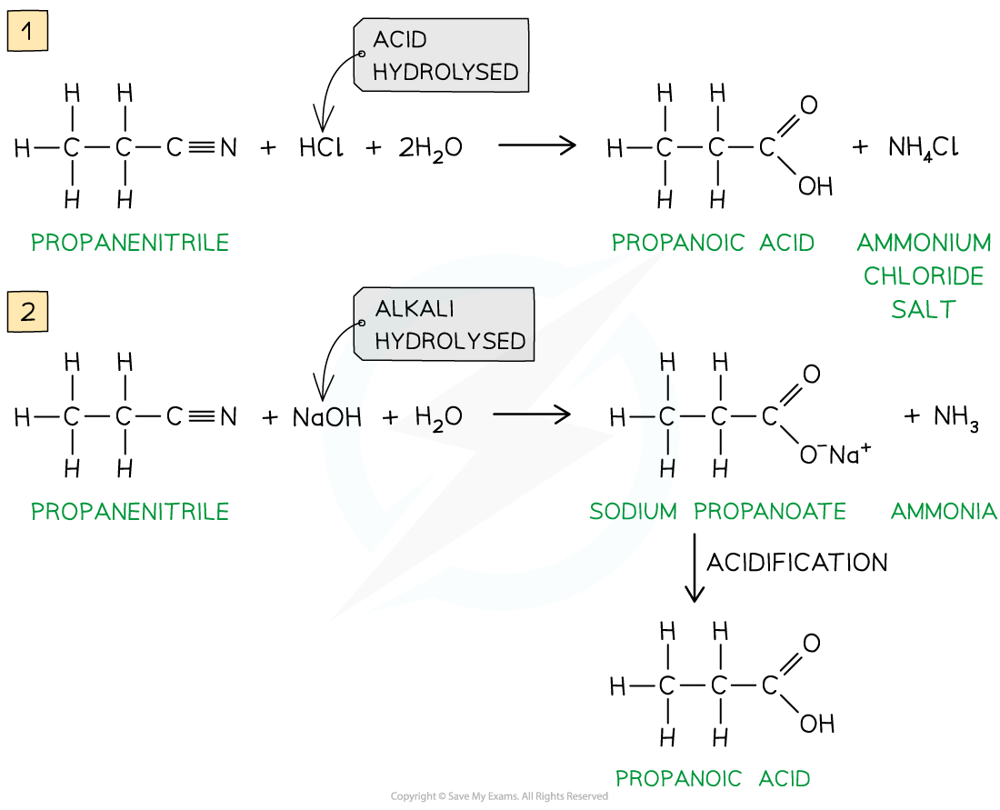

## Preparation of Carboxylic Acids

* **Carboxylic acids** are compounds with a -COOH functional group
* They can be prepared by a series of different reactions

#### Oxidation of primary alcohols & aldehydes

* Carboxylic acids can be formed from the **oxidation** of **primary alcohols** and **aldehydes** by either **acidified K****2****Cr****2****O****7**or **acidified KMnO****4**and **reflux**
* The oxidising agents themselves get reduced causing the solutions to change colour

  + In K2Cr2O7 the orange dichromate ions (Cr2O72-) are reduced to green Cr3+ ions
  + In KMnO4the purple manganate ions (MnO4-) are reduced to colourless Mn2+ ions

***Oxidation of primary alcohols (1) and aldehydes (2) gives carboxylic acids***

#### Hydrolysis of nitriles

* Carboxylic acids can also be prepared from the **hydrolysis** of **nitriles** using either **dilute acid** or **dilute alkali followed by acidification**

  + Hydrolysis by dilute acid results in the formation of a carboxylic acid and ammonium salt
  + Hydrolysis by dilute alkali results in the formation of a sodium carboxylate salt and ammonia; Acidification is required to change the carboxylate ion into a carboxylic acid
* The -CN group at the end of the hydrocarbon chain is converted to a -COOH group

***Hydrolysis of nitriles by either dilute acid (1) or dilute alkali and acidification (2) will form a carboxylic acid***