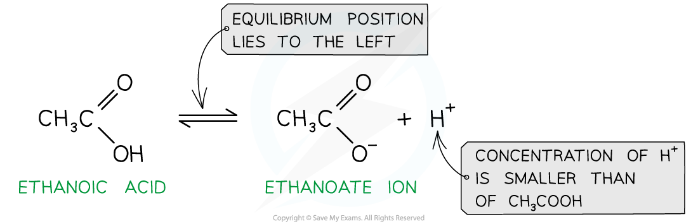
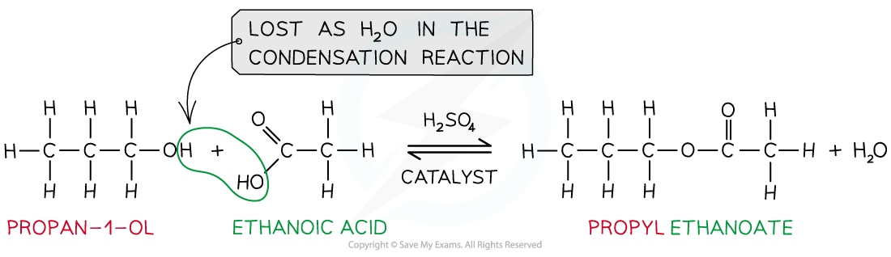

## Reactions of Carboxylic Acids

* In aqueous solution they are only slightly ionised, to give low concentrations of hydronium ions and alkanoate ions (often called carboxylate ions)

* This **partial ionisation** in solution means that carboxylic acids are **weak acids**
* This means that the position of the equilibrium lies to the left and that the concentration of H+ is much smaller than the concentration of the carboxylic acid
* However, the concentration of hydrogen ions is sufficient to react with an aqueous solution of sodium carbonate or sodium hydrogen carbonate to produce carbon dioxide
* These reactions are a useful test for the possible presence of a carboxylic acid:

  + Sodium carbonate: 2RCOOH + Na2CO3 → 2RCOO-Na++ CO2 + H2O
  + Ionic equation with carbonates: 2RCOOH + CO32- → 2RCOO- + CO2 + H2O
  + Sodium hydrogen carbonate: RCOOH + NaHCO3 → RCOO-Na+ + CO2 + H2O
  + Ionic equation with hydrogen carbonates: RCOOH + HCO3- → RCOO- + CO2 + H2O

***Carboxylic acids are weak acids that do not fully dissociate in water, the position of the equilibrium lies to the left***

#### Reaction with LiAlH4

* Carboxylic acids can undergo reduction when they react with a reducing agent such as **lithium tetrahydridoaluminate,** LiAlH4, suspended in dry ether at room temperature
* A carboxylic acid will be reduced to a primary alcohol, for example

**CH****3****CH****2****COOH (l) + 4[H] → CH****3****CH****2****CH****2****OH (l) + H****2****O (l)**

* Addition of water at the end will destroy any excess lithium tetrahydridoaluminate

#### Reaction with bases

* Carboxylic acids can form salts with metals, alkalis and carbonates.
* In the reaction with **metal oxides** a metal salt and water are produced

  + For example in reaction with magnesium the salt magnesium ethanoate is formed:

**2CH****3****COOH (aq) + MgO (s) → (CH****3****COO)****2****Mg (aq) + H****2****O (l)**

* In the reaction with **alkalis** a salt and water are formed in a neutralisation reaction

  + For example in reaction with potassium hydroxide the salt potassium ethanoate is formed:

**CH****3****COOH (aq) + KOH (aq) → CH****3****COOK (aq) + H****2****O (l)**

* In the reaction with **carbonates** a metal salt, water and carbon dioxide gas are produced

  + For example in reaction with potassium carbonate the salt potassium ethanoate is formed:

**2CH****3****COOH (aq) + K****2****CO****3****(s) → 2CH****3****COOK (aq) + H****2****O (l) + CO****2** **(g)**

#### Reaction with phosphorus(V) chloride

* Carboxylic acids react with solid phosphorus(V) chloride to form an acyl chloride
* For example, propanoic acid will react with phosphorus(V) chloride to form propanoyl chloride, phosphorus trichloride oxide and hydrogen chloride

**CH****3****CH****2****COOH (l) + PCl****5****(s) → CH****3****CH****2****COCl (l) + POCl****3****(l) + HCl (g)**

* In this reaction, steamy fumes of HCl are produced
* The liquid products can be separated by fractional distillation

#### Reaction with alcohols

* When carboxylic acids react with alcohols an ester is formed
* **Esters** are compounds with an -COOR functional group and are characterised by their **sweet** and **fruity** smells
* They are prepared from the **condensation** reaction between a **carboxylic acid** and **alcohol** with **concentrated H****2****SO****4**as **catalyst**

  + This is also called **esterification**
* The first part of the ester’s name comes from the alcohol and the second part of the name comes from the carboxylic acid

  + E.g. Propanol and ethanoic acid will give the ester propyl ethanoate

***Esters are formed from the condensation reaction between carboxylic acids and alcohols***