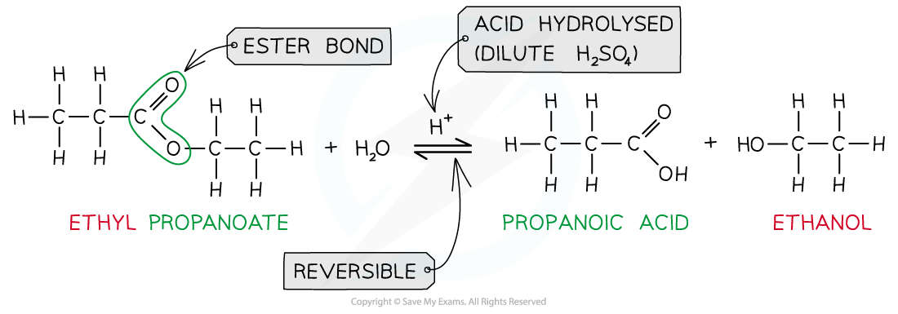
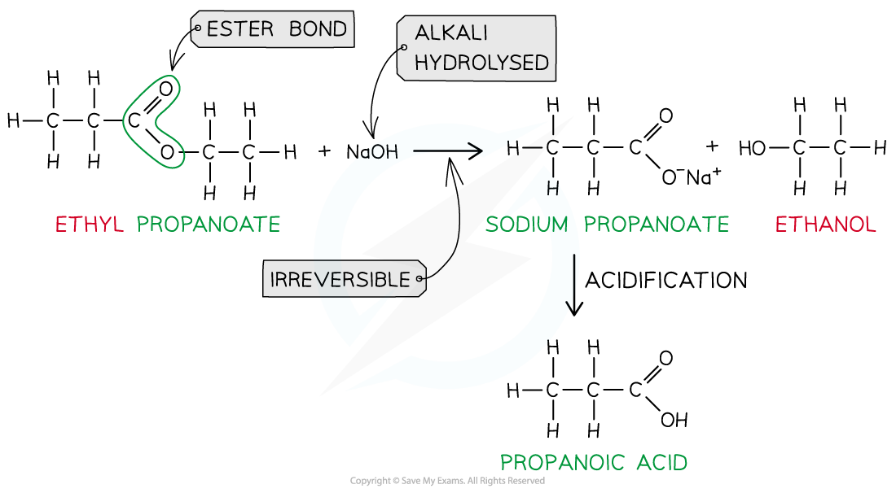
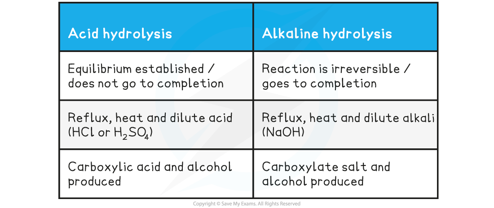
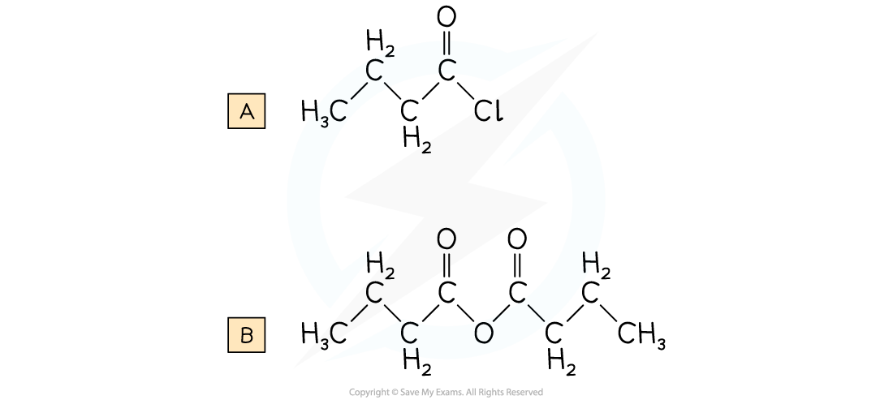
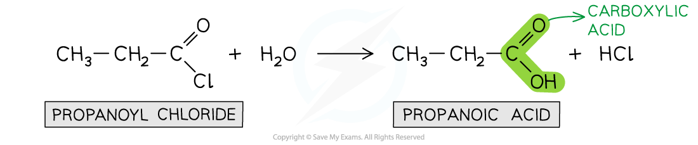
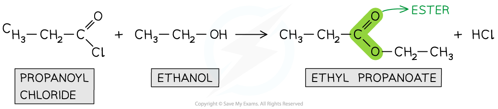
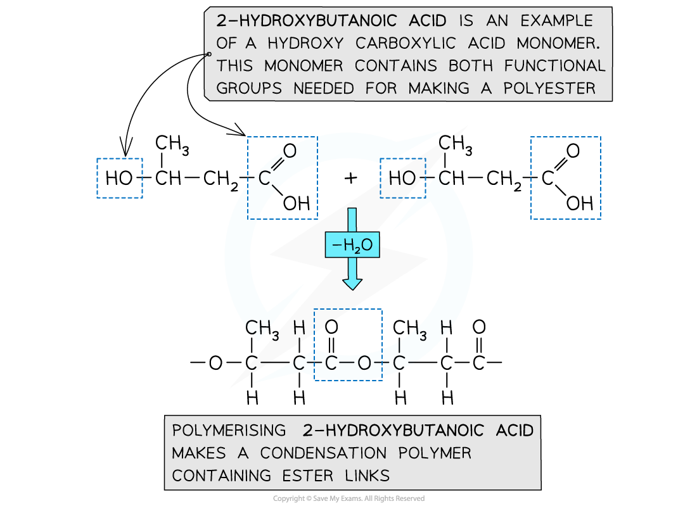

## Hydrolysis of Esters

#### Hydrolysis of Esters - Acid

* The reverse of the esterification reaction is called **hydrolysis**
* Ester hydrolysis is a useful reaction for creating biodegradable plastics
* Esters can be **hydrolysed** to reform the carboxylic acid and alcohol or salts of carboxylic acids by using either **dilute acid** (e.g. sulfuric acid) or **alkali** (e.g. sodium hydroxide) and **heat**
* When an ester is **heated under reflux** with **acid** an equilibrium mixture is established, meaning that the hydrolysis reaction is not complete

***Ester hydrolysis by dilute acid is a reversible reaction forming carboxylic acid and alcohol***

#### Hydrolysis of Esters - Alkaline

* However, **heating** the ester **under reflux** with **dilute alkali** (e.g. sodium hydroxide) is an **irreversible** reaction as the ester is fully hydrolysed and the reaction goes to completion
* The carboxylic acid produced reacts with excess alkali to form a **carboxylate salt** and **alcohol**
* The **sodium** **carboxylate** salt requires further **acidification** to turn into a **carboxylic** **acid**

  + The sodium carboxylate (-COO-) ion needs to get protonated by an acid (such as HC*l*) to form the carboxylic acid (-COOH)

***Ester hydrolysis by dilute alkali is an irreversible reaction forming a sodium carboxylate salt and alcohol***

**Table showing Differences in Hydrolysis of Esters**

#### Worked Example

Name the products and write equations for the following hydrolysis reaction:

1. Ethyl ethanoate with hot dilute sulfuric acid solution
2. Methyl propanoate by hot sodium hydroxide solution

**Answer:**

**Answer 1:** Ethanoic acid and ethanol

CH3COOCH2CH3 + H2O ⇌ CH3COOH + CH3CH2OH

**Answer 2:** Sodium propanoate and methanol

CH3CH2COOCH3 + NaOH → CH3CH2COONa + CH3OH

## Acyl Chlorides & Esters

Acyl groups Acyl groups can be built into many molecules using acyl chlorides or acid anhydrides (known as acylating agents) Acyl chlorides are **derivatives of carboxylic acids** by substitution of the -OH group by a chlorine atom Acyl chlorides are named by identifying the parent hydrocarbon chain and adding the suffix -*oyl chloride* They can also be named by removing the -oic acid from the carboxylic acid and adding -*oyl chloride*

* Acid anhydrides are also **derivatives of carboxylic acids** formed by substitution of the -OH group by an alkanoate

  + Acid anhydrides are named by identifying the parent hydrocarbon chain and adding the suffix -*oic anhydride*
  + They can also be named by removing the -oic acid from the carboxylic acid and adding -*oic anyhydride*

**Ethanoic acid derivatives**

#### Worked Example

Draw the displayed formula for the following:

A. Butanoyl chloride

B. Butanoic anhydride

**Answer:**

* **Acyl chlorides** are **reactive** organic compounds that undergo many reactions such as **nucleophilic addition-elimination** reactions
* In nucleophilic addition-elimination reactions, the **nucleophilic addition** of a small molecule across the C=O bond takes place followed by **elimination** of a small molecule
* Examples of these nucleophilic addition-elimination reactions include:

  + **Hydrolysis**
  + Reaction with alcohols to form **esters**
  + Reaction with ammonia and primary amines to form **amides**

#### Hydrolysis

* The **hydrolysis** of acyl chlorides results in the formation of a **carboxylic acid** and **HC*****l*** molecule
* This is a **nucleophilic addition-elimination** reaction

  + A **water molecule** adds across the C=O bond
  + A hydrochloric acid (HCl) molecule is **eliminated**
* An example is the hydrolysis of propanoyl chloride to form propanoic acid and HCl

***Acyl chlorides are hydrolysed to carboxylic acids***

#### Formation of esters

* Acyl chlorides can react with **alcohols**to form esters
* The esterification of acyl chlorides is also a **nucleophilic addition-elimination** reaction

  + The alcohol adds across the C=O bond
  + A HCl molecule is eliminated

***Acyl chlorides undergo esterification with alcohols to form esters***

#### Formation of amides

* Acyl chlorides can form **amides** with **primary** **amines** and **concentrated** **ammonia**
* The nitrogen atom in ammonia and primary amine has a lone pair of electrons which can be used to attack the carbonyl carbon atom in the acyl chlorides
* The product is anamide (when reacted with ammonia) or ***N-*****substituted** amide (when reacted with primary amines)
* This is also an example of a **nucleophilic addition-elimination** reaction as

  + The amine or ammonia molecule adds across the C=O bond
  + A HCl molecule is eliminated

***Acyl chlorides undergo reactions with ammonia and primary amines to form amides***

## Polyesters

* Addition polymerisation has been covered in reactions of alkenes

  + They are made using monomers that have C=C double bonds joined together to form polymers such as polyethene
* Condensation polymerisation is another type of reaction whereby a polymer is produced by repeated condensation reactions between monomers
* Natural condensation polymers are all formed by **elimination of water**

  + Although the process of **condensation** polymerisation involves the **elimination of a small molecule**
* **Condensation polymers** can be identified because the monomers are linked by **ester** or **amide bonds**

#### Polyester

* Is formed by the reaction between **dicarboxylic acid monomers** and **diol monomers**
* Polyester is produced by linking these monomers with **ester bonds / links**

***This polymer structure shows an ester functional group linking monomers together***

#### Formation of polyesters

* A diol and a dicarboxylic acid are required to form a polyester

  + A diol contains 2 -OH groups
  + A dicarboxylic acid contains 2 -COOH groups

***The position of the functional groups on both of these molecules allows condensation polymerisation to take place effectively***

* When the polyester is formed, one of the -OH groups on the diol and the hydrogen atom of the -COOH are expelled as a water molecule (H2O)
* The resulting polymer is a polyester

  + In this example, the polyester is **poly(ethylene terephthalate)** or PET, which is sometimes known by its brand names of Terylene or Dacron

***Expulsion of a water molecule in this condensation polymerisation forms the polyester called (ethylene terephthalate) (PET)***

#### Formation of polyesters - hydroxycarboxylic acids

* So far the examples of making polyesters have focused on using 2 separate monomers for the polymerisation
* There is another route to making polyesters
* A single monomer containing both of the key functional groups can also be used
* These monomers are called hydroxycarboxylic acids

  + They contain an alcohol group (-OH) at one end of the molecule while the other end is capped by a carboxylic acid group (-COOH)

***Both functional groups that are needed to make the polyester come from the same monomer***