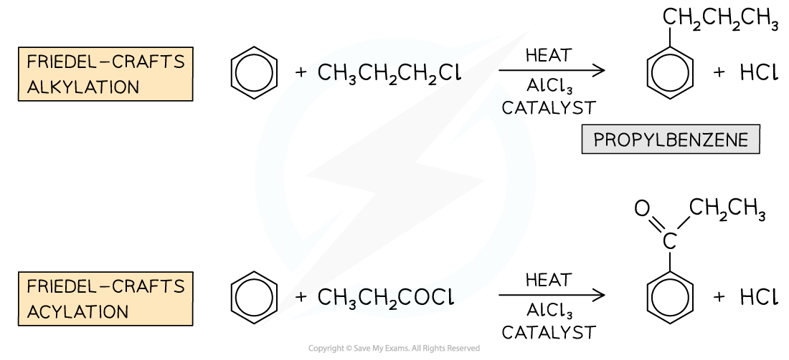

## Reactions of Benzene

#### Reaction with oxygen

* Hydrocarbons will burn in air or oxygen to produce carbon dioxide and water providing sufficient oxygen is available
* Benzene reacts will also follow this pattern

**2C****6****H****6** **(l) + 15O****2****(g) → 12CO****2****(g) + 6H****2****O (g)**

* Given that a large volume of oxygen is required for this reaction, incomplete combustion could occur

  + Therefore unreacted benzene may remain
* This would lead to a smokey yellow flame as there would be insufficient oxygen available

#### Halogenation

* The nature of benzene is different to other unsaturated compounds such as alkenes and halogenation via electrophilic addition is not possible
* Therefore aromatic compounds will react with halogens in the presence of a **metal halide carrier**

  + iron(III) bromide
  + aluminium chloride
* The reaction of the metal halide carrier acts as catalyst and creates the electrophile, X+(where X represents a halogen atom)
* At the end of the reaction it is regenerated

**AlCl****3** **+ Cl****2** **→ AlCl****4****-** **+ Cl****+**

**FeBr****3** **+ Br****2****→ FeBr****4****-** **+ Br****+**

* The overall equation for halogenation is

**C****6****H****6****+ X****2** **→ C****6****H****5****X + HX**

**Or with Br****2** **in the presence of a AlBr****3**

**C****6****H****6****+ Br****2** **→ C****6****H****5****Br + HBr**

***Bromination of benzene***

* Remember that one hydrogen atom on the benzene ring has been substituted for one halogen atom, therefore HX will be a product

#### Nitration

* Another example of a substitution reaction is the **nitration** of arenes
* In these reactions, a nitro (-NO2) group replaces a hydrogen atom on the arene
* The benzene is reacted with a mixture of concentrated nitric acid (HNO3) and concentrated sulfuric acid (H2SO4) at a temperature between 25 and 60 oC

***Nitration of benzene***

#### Friedel-Crafts Reactions

* Friedel-Crafts reactions are alsosubstitutionreactions
* Due to the aromatic stabilisation in arenes, they are often **unreactive**
* To use arenes as **starting materials** for the synthesis of other organic compounds, their structure, therefore, needs to be changed to turn them into more reactive compounds
* Friedel-Crafts reactions can be used to substitute a hydrogen atom in the benzene ring for an **alkyl group** (Friedel-Crafts alkylation) or an **acyl group** (Friedel-Crafts acylation)
* Like any other electrophilic substitution reaction, the Friedel-Crafts reactions consist of three steps:

  + Generating the electrophile
  + Electrophilic attack on the benzene ring
  + Regenerating aromaticity of the benzene ring

***Examples of Friedel-Crafts alkylation and acylation reactions***