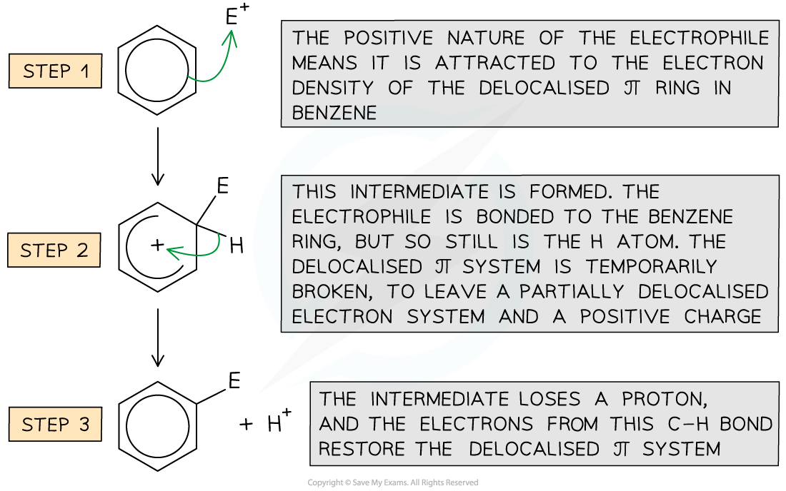
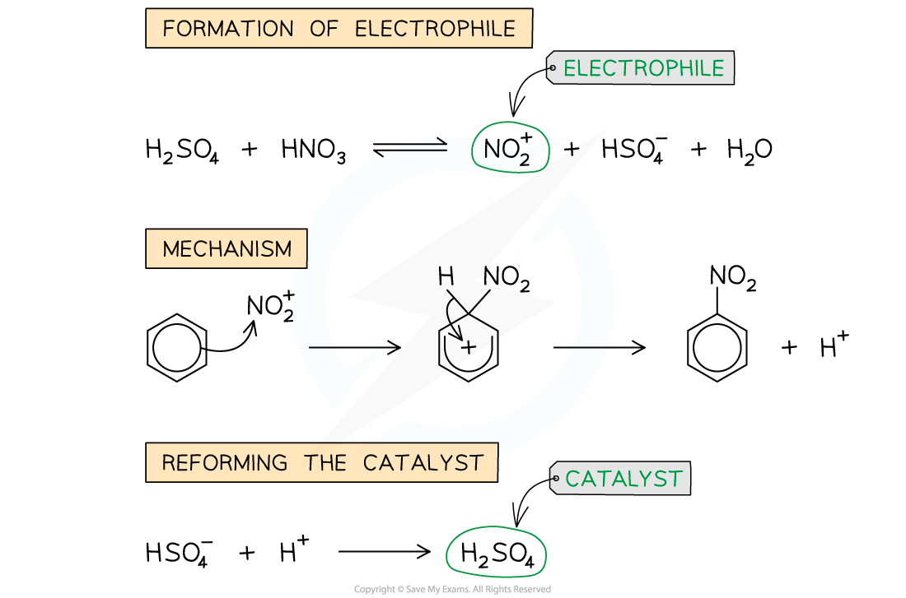
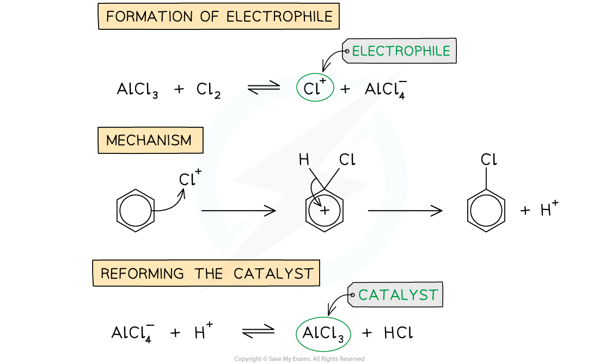
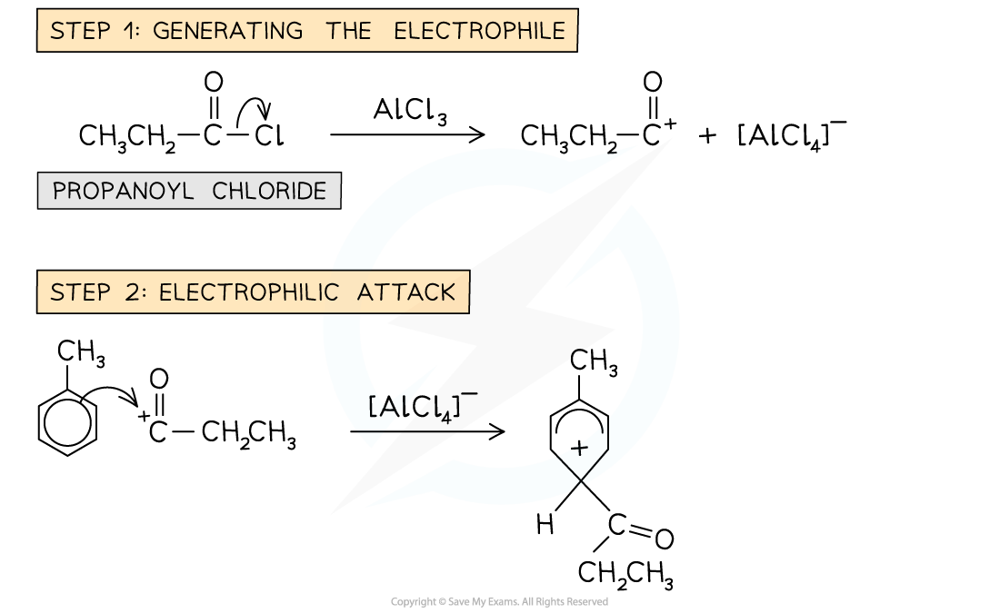

## Electrophilic Substitution

#### Reactions of Benzene

* The main reactions which benzene will undergo include the replacement of one of the 6 hydrogen atoms from the benzene ring

  + This is different to the reactions of unsaturated alkenes, which involve the double bond breaking and the electrophile atoms 'adding on' to the carbon atoms
* These reactions where at least one of the H atoms from benzene are replaced, are called electrophilic substitution reactions

  + The hydrogen atom is substituted by the electrophile
* You must be able to provide the mechanisms for specific examples of the electrophilic substitution of benzene

#### General Electrophilic Substitution Mechanism:

* The delocalised π system is extremely stable and is a region of high electron density
* Electrophilic substitution reactions involve an electrophile, which is either a positive ion or the positive end of a polar molecule
* There are numerous electrophiles which can react with benzene

  + However, they usually cannot simply be added to the reaction mixture to then react with benzene
  + The electrophile has to be produced in situ, by adding appropriate reagents to the reaction mixture

* The **electrophilic substitution** reaction in arenes consists of **three steps**:

  + Generation of an **electrophile**
  + **Electrophilic attack**
  + Regenerating **aromaticity**

#### Nitration of benzene mechanism

* In the **first** step, the **electrophile** is generated

  + The electrophile **NO****2****+** ion is generated by reacting **concentrated** nitric acid (HNO3) and **concentrated** sulfuric acid (H2SO4)

#### Halogenation of benzene mechanism

* Benzene will undergo a substitution reaction with a halogen if a metal halide carrier is present
* This generates the electrophile for the reaction to occur

***The different stages in the chlorination of benzene***

#### Friedel-Crafts acylation mechanism

* In the Friedel-Crafts acylation reaction, an **acyl group** is substituted into the benzene ring

  + An acyl group is an alkyl group containing a carbonyl, C=O group

***Example of a Friedel-Crafts acylation reaction***