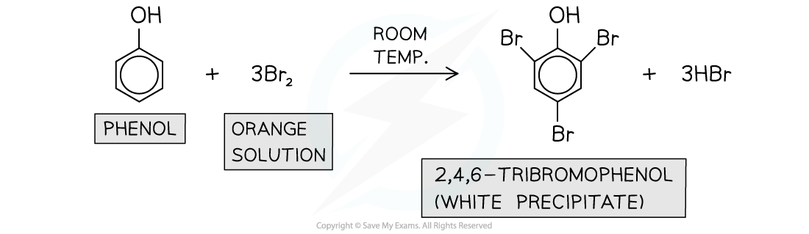

## Bromination of Phenol

#### Reactions of the aromatic ring in phenols

* Phenols react more readily with electrophiles compared to benzene
* This is because one of the lone pairs of electrons on the oxygen atom in -OH overlaps with the π bonding system
* This **increases the electron density** of the benzene ring making it more susceptible to electrophilic attack
* The -OH group in phenols is activating and directs incoming electrophiles to the **2, 4, and 6 positions**

#### Bromination

* Phenols also undergo electrophilic substitution reactions when reacted with bromine water at room temperature
* Phenol **decolourises** the **orange** bromine solution to form a **white precipitate** of 2,4,6-tribromophenol
* This is also known as the **bromination of phenol**

***Phenols undergo bromination when reacted with bromine water at room temperature***