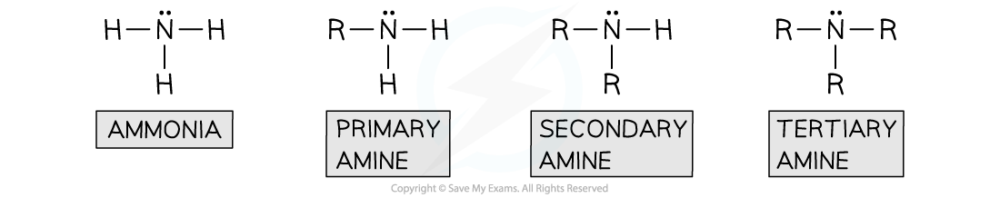
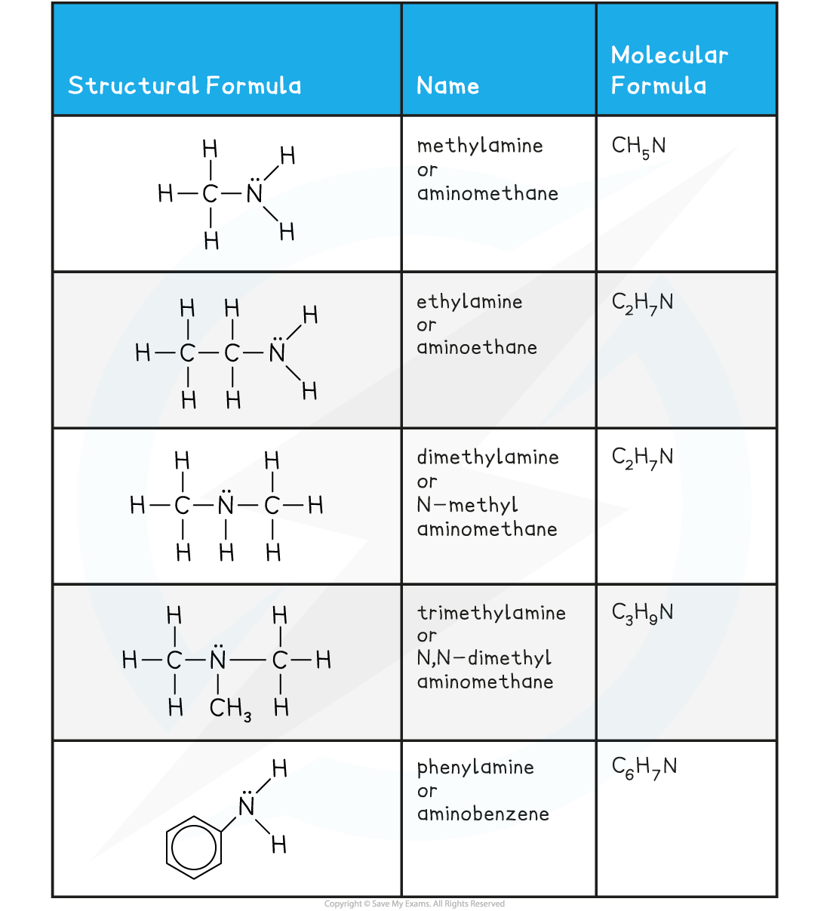
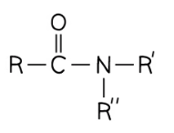
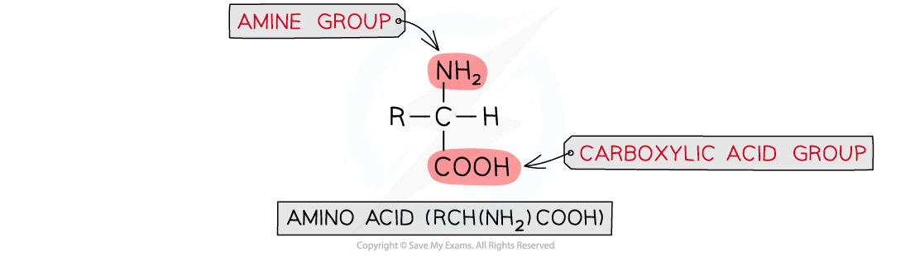
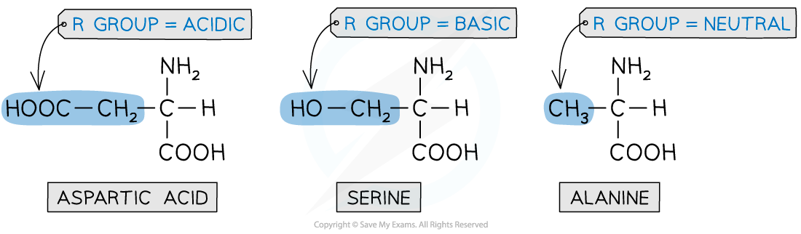

## Amines, Amides & Amino Acids

* **Amines** can be thought of as derivates of ammonia, in which one or more of the hydrogens is replaced by an alkyl or aryl group
* The number of substituted hydrogens is the basis of classifying amines

***Classification of amines***

* Notice the classification is not the same as in alcohols and haloalkanes, where the designation primary, secondary and tertiary is based on the substituents on the *carbon* atom rather than the *nitrogen* atom
* If the R group is an alkyl group (methyl, ethyl, etc) then then it is an **aliphatic amine;** if it is an aryl group (benzene ring or phenyl) then it is an **aromatic amine**
* Aliphatic and aromatic amines share similar chemical reactions and the aryl group can strongly influence the chemistry and reactivity of the amine group

#### Naming Amines

* Amines can be named using common names or IUPAC systematic names
* The common way to name amines is to use the alkyl (or aryl) prefix followed by **-amine**
* The IUPAC systematic name uses the numbered prefix **amino-** followed by the alkane (or aromatic) stem

**Nomenclature of Aliphatic and Aromatic Amines Table**

#### Amides

* **Amides**are formed from the **condensation reaction** of **carboxylic acids**or **acyl chlorides**with **ammonia**or **amines**
* Amides are common in nature such as in proteins where the amine and carboxylic acid groups of amino acids bond together
* Amides have a general structure of RCONR2

***The general structure of an amide***

* Amides can be classified as primary, secondary or tertiary amides
* Like amines, this is done as a comparison to ammonia, depending on the number of substitutions on the amide nitrogen

  + Primary amide - one carbon bonded to the amide nitrogen

    - R' and R'' are both hydrogen atoms so one "ammonia" hydrogen has been substituted with the carbonyl group from the RCO portion of the molecule
  + Secondary amide - two carbons bonded to the amide nitrogen (one MUST be the carbonyl carbon)
  + Tertiary amide - three carbons bonded to the amide nitrogen (one MUST be the carbonyl carbon)

**Naming primary amides**

* For primary amides, we simply add -amide to the stem name

  + e.g. CH3CONH2

    - Contains two carbons with a C-C (ethan-) and an amide group (-amide)
    - This gives us ethanamide

**Naming secondary amides**

* For secondary amides, the alkyl chain attached to the nitrogen is added at the start of the chemical name
* This alkyl chain is prefixed with N-
* The chain containing the carbonyl group is named the same as a primary amide

  + e.g. CH3CONH(C3H7)

    - Contains a propyl group on the nitrogen (N-propyl)
    - Contains two carbons with a C-C (ethan-) and an amide group (-amide)
    - This gives us N-propylethanamide

**Naming tertiary amides**

* For tertiary amides, there are two alkyl chains attached to the nitrogen
* The naming of these chains is the same as secondary amides
* As with standard nomenclature, these chains are listed in alphabetical order and the prefix 'di-' is used if necessary

  + e.g. CH3CONCH3(C3H7)

    - Contains a methyl group on the nitrogen (N-methyl)
    - Contains a propyl group on the nitrogen (N-propyl)
    - Contains two carbons with a C-C (ethan-) and an amide group (-amide)
    - This gives us N-methyl-N-propylethanamide

#### Amino acids

* **Amino acids** are organic compounds that contain two functional groups:

  + A basic **amino**(-NH2) group
  + An acidic **carboxylic acid** (-COOH) group
* Due to the presence of both a basic and acidic group in amino acids, they are said to be amphoteric

  + They can act as both acids and bases

**Naturally occurring amino acids**

* 2-aminocarboxylic acids are a type of amino acids in which the amine (-NH2) group is bonded to the carbon atom next to the -COOH group
* These type of amino acids form the ‘building blocks’ that make up **proteins**
* There are 20 naturally occurring amino acids with the general structural formula of **RCH(NH2)COOH**

***General structural formula of amino acids***

***General structural formula of amino acids***

* The **R**group varies in different amino acids and can be:

  + Acidic
  + Basic
  + Neutral

***The R group varies in different amino acids***