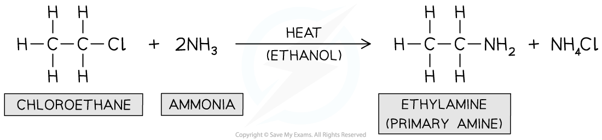
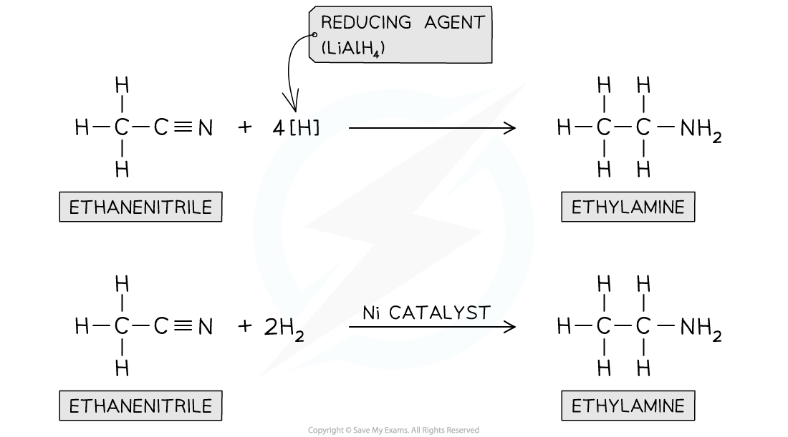

## Reactions of Primary Aliphatic Amines

#### Reactions with water

* The first few members of the homologous series of primary aliphatic amines are miscible with water

  + However as the hydrocarbon part of the molecule becomes longer, the solubility decreases
  + Phenylamine is only slightly soluble in water
* They dissolve in water as they are able to form hydrogen bonds with water molecules
* Amines also react slightly with water to form alkaline solutions

**CH****3****NH****2** **+ H****2****O ⇌ CH****3****NH****3****+** **+ OH****-**

#### Reactions with acids

* Amines react with strong acids to form ionic ammonium salts

**CH****3****NH****2** **(aq) + HCl (aq) → CH****3****NH****3****+****Cl****-****(aq)**         Methylamine           methylammonium chloride

* Addition of NaOH to an ammonium salt will convert it back to the amine
* These ionic salts will be solid crystals, if the water is evaporated, because of the strong ionic interactions
* The ionic salts formed in this reaction means that the compounds are soluble in the acid

  + e.g. Phenylamine is not very soluble in water but phenylammonium chloride is soluble

#### Reactions with ethanoyl chloride

* This reaction type is addition-elimination reaction meaning two molecules join together, and then a small molecule is eliminated - in these examples, hydrogen chloride

  + You do not need to know the mechanism of these reactions
* The organic product contains a new functional group - amide - in which a carbonyl group is next to an NH group
* The equation for the reaction of butylamine with ethanoyl chloride is

**CH****3****COCl + CH****3****CH****2****CH****2****CH****2****NH****2** **→ CH****3****CONHCH****2****CH****2****CH****2****CH****3** **+ HCl**

#### Reaction with halogenoalkanes

* Again you do not need to know the mechanism for these reactions
* The electron-deficient carbon atom in the halogenoalkane and the electron-rich atom nitrogen atom in the amine causes these two species to react together
* The general formula for this reaction would be

**R'NH****2** **+ R"X → R'NHR" + HX**

* Where R' is the alkyl group in the amine and R" is the alkyl group in the halogenoalkane
* This reaction is an example of a substitution reaction
* The organic product is a secondary amine and the inorganic product is a hydrogen halide, often hydrogen chloride
* As an example, the equation for the reaction of butylamine and chloroethane is

**CH****3****CH****2****CH****2****CH****2****NH****2** **+  CH****3****CH****2****Cl → CH****3****CH****2****CH****2****CH****2****NHCH****2****CH****3****+ HCl**

* The organic product contains an electron-rich nitrogen atom, so can also react with chloroethane

**CH****3****CH****2****CH****2****CH****2****NHCH****2****CH****3** **+  CH****3****CH****2****Cl →  CH****3****CH****2****CH****2****CH****2****N(CH****2****CH****3****)****2****+ HCl**

* The organic product of this reaction is a tertiary amine
* The organic product also contains an electron-rich nitrogen atom, so can also react with chloroethane

**CH****3****CH****2****CH****2****CH****2****N(CH****2****CH****3****)****2** **+  CH****3****CH****2****Cl → CH****3****CH****2****CH****2****CH****2****N****+****(CH****2****CH****3****)****3****Cl****-**

* In this reaction HCl is not formed because this would require the loss of H from the nitrogen from the organic reactant, which the tertiary amine doesn't have
* The product is an ionic compound related to ammonium chloride except that all the hydrogens in the ammonium ion have been replaced by alkyl groups

  + This is known as a quaternary ammonium salt

#### Reactions with copper(II) ions

* Ammonia can act as a lone pair donor in its reactions with transition metal ions
* For example the overall equation for the reaction of ammonia with hexaaquacopper(II) ions is

**[Cu(H****2****O)****6****]****2+** **+ 4NH****3****→ [Cu(NH****3****)****4****(H****2****O)****2****]****2+** **+ 4H****2****O**

* Amines also have a lone pair of electrons on the nitrogen, so can take part in similar reactions
* The observations are the same as with ammonia

  + A blue precipitate forms
  + With excess butylamine the precipitate dissolves to give a blue solution
* Formation of the pale blue precipitate

**[Cu(H****2****O)****6****]****2+** **+ 2CH****3****CH****2****CH****2****CH****2****NH****2** **→ [Cu(H****2****O)****4****(OH)****2****] + 2CH****3****CH****2****CH****2****CH****2****NH****3****+**

* Formation of the deep blue solution

**[Cu(H****2****O)****4****(OH)****2****] + 4CH****3****CH****2****CH****2****CH****2****NH****2** **→ [Cu(CH****3****CH****2****CH****2****CH****2****NH****2****)****4****(H****2****O)****2****]****2+** **+ 2H****2****O +2OH****-**

## Preparation of Primary Aliphatic Amines

#### Preparing Amines

* Primary amines can be prepared from different reactions including:

  + The reaction of halogenoalkanes with ammonia
  + The reduction of nitriles

#### Reaction of halogenoalkanes with ammonia

* This is a **nucleophilic substitution**reaction in which the nitrogen lone pair in ammonia acts as a **nucleophile**and **replaces**the halogen in the halogenoalkane
* When a halogenoalkane is reacted with **excess, hot ethanolic ammonia under pressure**a **primary amine**is formed

***Formation of primary amine***

#### Reduction of nitriles

* Nitriles contain a -CN functional group which can be **reduced** to an -NH2 group
* The nitrile vapour and **hydrogen gas**are passed over a **nickel catalyst**or **LiAlH****4**in **dry ether** can be used to form a **primary amine**

***Nitriles can be reduced with LiAlH******4******or H******2******and Ni catalyst***