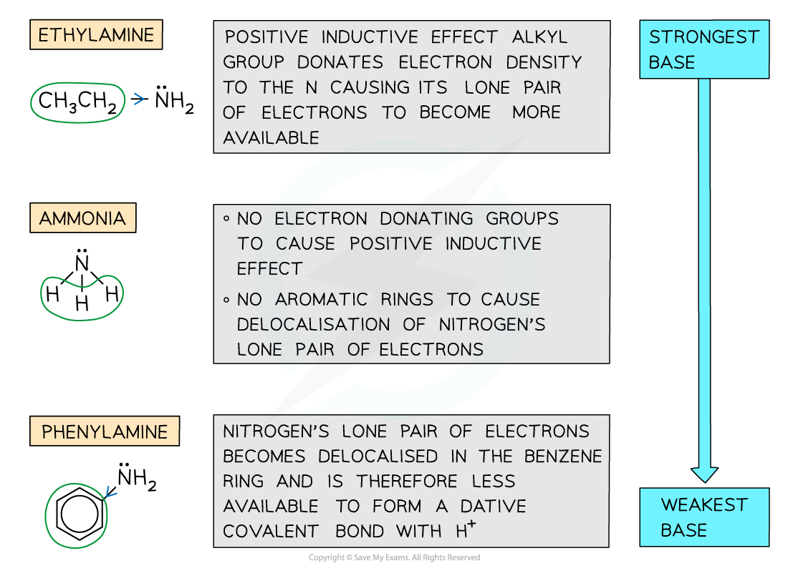

## Amine Basicity

* The nitrogen atom in ammonia and amine molecules can **accept**a **proton**(H+ ion)
* They can therefore act as Bronsted-Lowry **bases** in aqueous solutions by **donating**its lone pair of electrons to a proton and form a **dative bond**

***The nitrogen atom in ammonia and amines can donate its lone pair of electrons to form a bond with a proton and therefore act as a base***

* The **strength** of amines depends on the **ability**of the lone pair of electrons on the nitrogen atom to accept a proton and form a dative covalent bond
* The **more readily** a proton is attracted, the **stronger the base** is
* Factors that may affect the **basicity**of amines include:

  + **Positive inductive effect** - Some groups such as **alkyl groups**donate electron density to the nitrogen atom causing the lone pair of electrons to become more available and therefore **increasing**the amine’s **basicity**
  + **Delocalisation** - The presence of aromatic rings such as the **benzene ring** causes the lone pair of electrons on the nitrogen atom to be **delocalised**into the benzene ring
  + The lone pair becomes **less available**to form a dative covalent bond with ammonia and hence **decreases**the amine’s **basicity**
* Primary aliphatic amines are stronger bases than ammonia as the alkyl groups are electron releasing and push electrons towards the nitrogen atom and so make it a stronger base
* Secondary amines are stronger bases than primary amines because they have more alkyl groups that are substituted onto the nitrogen atom in place of hydrogen atoms

  + Therefore more electron density is pushed onto the nitrogen atom (as the inductive effect of alkyl groups is greater than that of hydrogen atoms)

    

***Base strength of aromatic amines***

* Primary aromatic amines such as phenylamine do not form basic solutions because the lone pair of electrons on the nitrogen delocalise with the ring of electrons in the benzene ring
* This means the nitrogen is less able to accept protons
* Ethylamine (which has an electron-donating ethyl group) is **more basic** than **phenylamine**(which has an electron-withdrawing benzene ring)

***Ethylamine is more basic than phenylamine due to electron donating ethyl group which increases electron density on the nitrogen and makes it more attractive to protons***