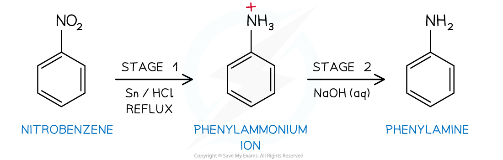

## Aromatic Amine Formation

* **Phenylamine**is an organic compound consisting of a benzene ring and an **amine** (NH2) functional group

  + Phenylamine is sometimes known as aminobenzene and aniline
* Nitrobenzene, C6H5NO2, can be reduced to phenylamine, C6H5NH2, according to the following two-stage reaction:

***The two-stage reduction reaction of nitrobenzene to phenylamine***

**Stage 1 - Reduction of nitrobenzene**

* Nitrobenzene, C6H5NO2, is reacted with tin, Sn, and concentrated hydrochloric acid, HCl

  + Tin and hydrochloric acid act as reducing agents
* The reaction mixture is heated under reflux in a boiling water bath
* The phenylammonium ions, C6H5NH3+, are protonated due to the acidic conditions

**Stage 2 - Formation of phenylamine**

* The phenylammonium ions, C6H5NH3+, are deprotonated by the addition of excess sodium hydroxide solution, NaOH (aq)