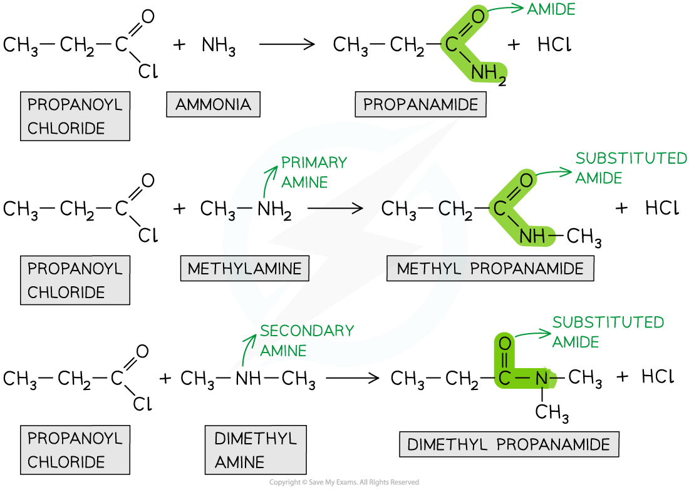
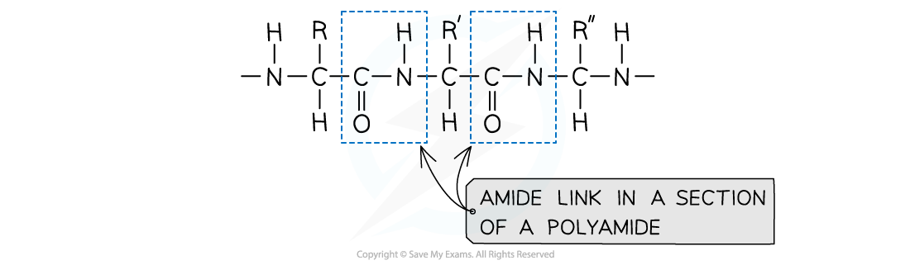
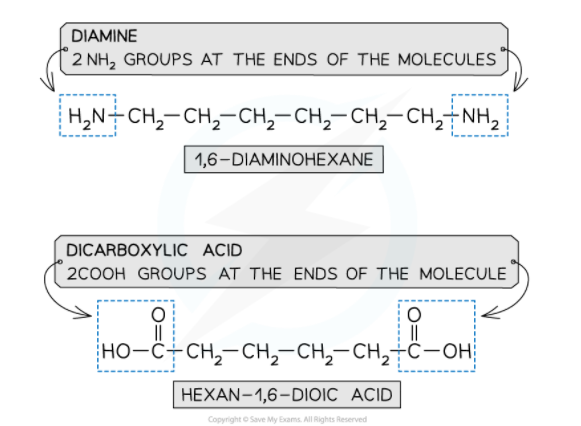
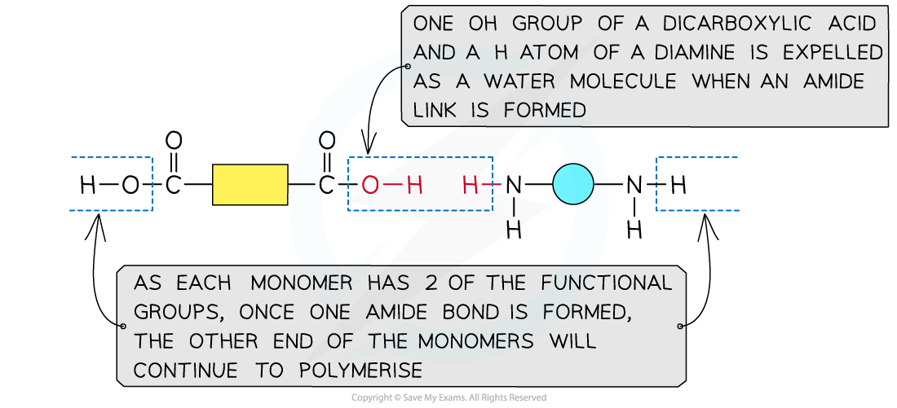
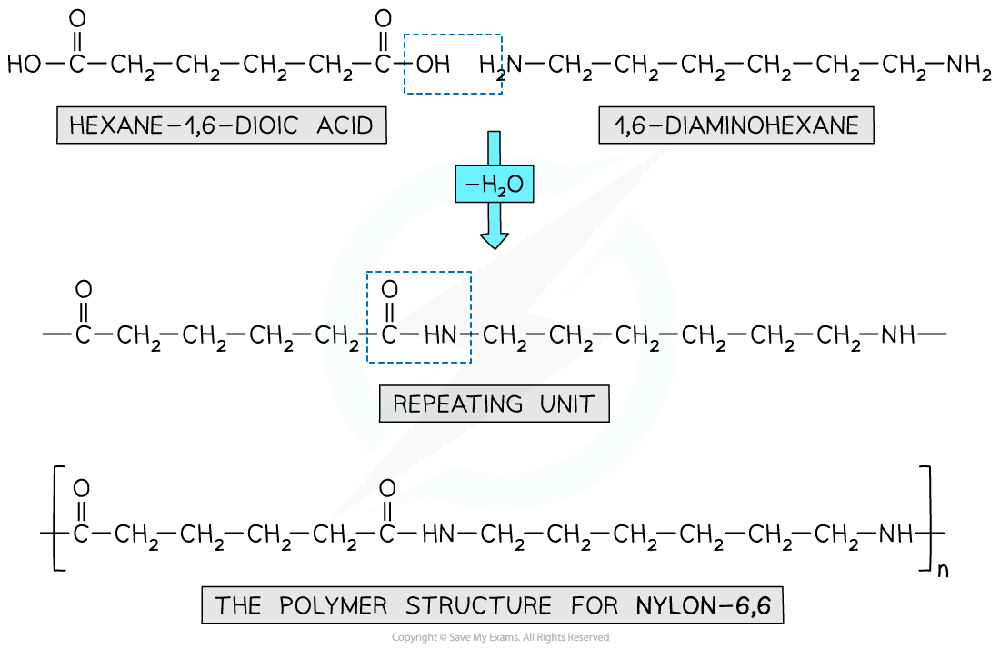
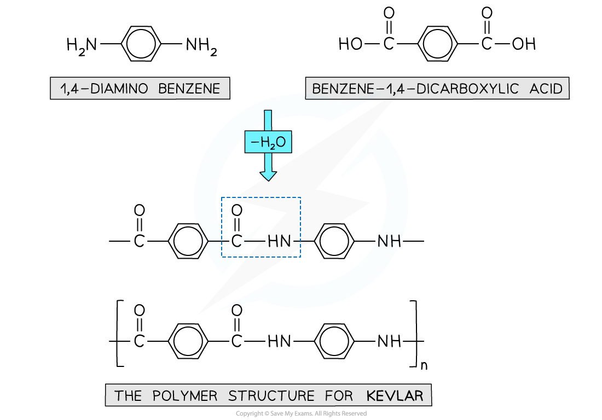

## Amide Formation

* **Amides**are organic compounds with an -CONR2 functional group
* They can be prepared from the **condensation reaction**between an **acyl chloride**and **ammonia**or **amine**
* In a **condensation**reaction, two organic molecules **join together**and in the process **eliminate**a small molecule
* In this case, the acyl chlorides and ammonia or amine **join together**to form an **amide**and **eliminate**an HCl molecule

#### Condensation reaction

* The chlorine atom in acyl chlorides is **electronegative**and draws electron density from the carbonyl carbon
* The carbonyl carbon is therefore **electron-deficient**and can be attacked by **nucleophiles**
* The nitrogen atom in ammonia and amines has a lone pair of electrons which can act as a **nucleophile**and attack the carbonyl carbon
* As a result, the C-Cl bond is **broken**and an **amide**is formed
* Whether the product is a **substituted**amide or not, depends on the nature of the **nucleophile**

  + Primary and secondary amines will give a **substituted amide**
  + The reaction of acyl chlorides with ammonia will produce a **non-substituted amide**

***Acyl chlorides undergo condensation reactions with ammonia and amines to form amides***

* Note that ammonia is basic and the inorganic product is acidic, so there will be a reaction between the two molecules

**NH****3** **+ HCl → NH****4****Cl**

* We can therefore write the overall equation for the reaction of propanoyl chloride and ammonia as

**CH****3****CH****2****COCl + 2NH****3** **→ CH****3****CH****2****CONH****2** **+ NH****4****Cl**

## Polyamide Formation

#### Amide link

* Polyamides are also formed using condensation polymerisation

***An amide link - also known as a peptide link - is the key functional group in a polyamide***

#### Monomers

* A diamine and a dicarboxylic acid are required to form a polyamide

  + A diamine contains 2 -NH2 groups
  + A dicarboxylic acid contains 2 -COOH groups

    

***The monomers for making polyamides***

#### Formation of polyamides

***This shows the expulsion of a small molecule as the amide link forms***

* Nylon 6,6 is a synthetic polyamide
* Its monomers are 1,6-diaminohexane and hexane-1,6-dioic acid

  + The ‘6,6’ part of its name arises from the 6 carbon atoms in each of Nylon 6,6 monomers

***Nylon 6,6 is a synthetic polyamide made using diamine and dicarboxylic acid monomers***

#### Kevlar

* Kevlar is another example of a polymer formed through condensation polymerisation
* The polymer chains are neatly arranged with many hydrogen bonds between them
* This results in a strong and flexible polymer material with fire resistance properties
* These properties also lend Kevlar to a vital application in bullet-proof vests
* The monomers used to make Kevlar

  + 1,4-diaminobenzene
  + Benzene-1,4-dicarboxylic acid

***Kevlar is made using a diamine and dicarboxylic acid monomers***