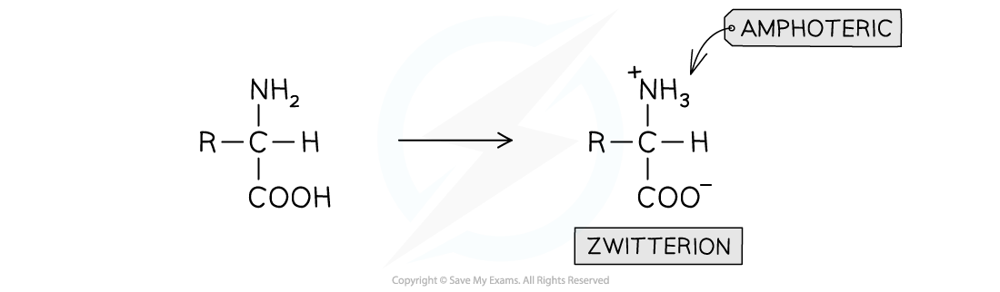
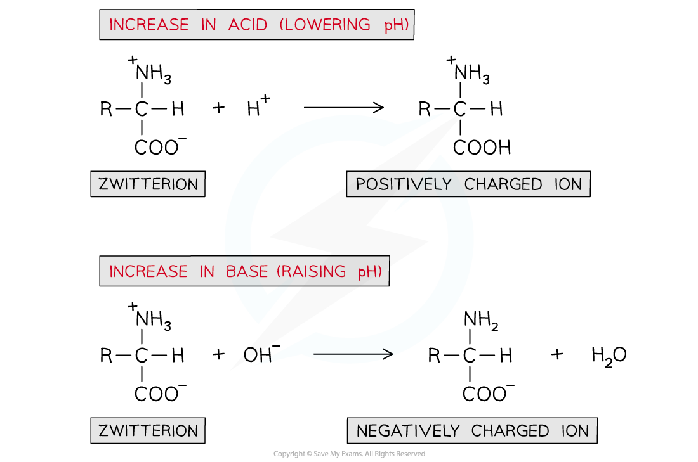
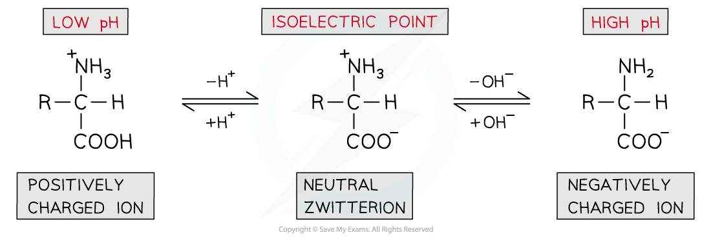
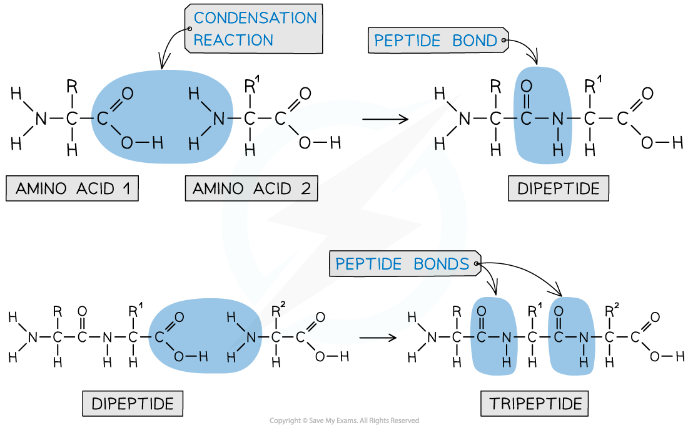
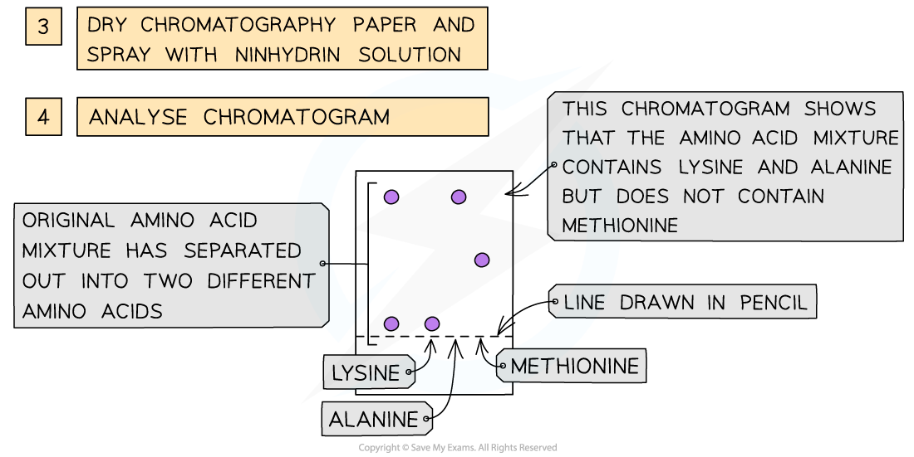

## Properties of 2-Amino Acids

#### Acid / base properties of amino acids

* Amino acids will undergo most reactions of amines and carboxylic acids including acid-base reactions of:

  + Amines with acids
  + Carboxylic acids with bases
* However, they can also interact **intramolecularly** (within themselves) to form a **zwitterion**
* A zwitterion is an ion with both a **positive**(-NH3+) and a **negative**(-COO-) charge
* Because of these charges in a zwitterion, there are **strong intermolecular forces of attraction** between amino acids

  + Amino acids are therefore **soluble crystalline solids**

***An amino acid molecule can interact within itself to form a zwitterion***

#### Isoelectric point

* A solution of amino acids in water will exist as **zwitterions**with both **acidic**and **basic**properties
* They act as **buffer solutions** as they resist any changes in pH when **small**amounts of acids or alkali are added
* If an acid is added (and thus the pH is **lowered**):

  + The -COO- part of the zwitterion will **accept** an H+ ion to reform the -COOH group
  + This causes the zwitterion to become a **positively charged ion**
* If a base is added (and thus the pH is **raised**):

  + The -NH3+ part of the zwitterion will **donate**an H+ ion to reform the -NH2 group
  + This causes the zwitterion to become a **negatively charged ion**

***A solution of amino acids can act as a buffer solution by resisting any small changes in pH***

* The pH can be slightly adjusted to reach a point at which neither the **negatively charged**or **positively charged**ions dominate and the amino acid exists as a **neutral zwitterion**

  + This is called the **isoelectric point**of the amino acid

***The isoelectric point of amino acids is the pH at which the amino acid exists as a neutral zwitterion***

#### Reactions of the amine group

* The amine group is basic and reacts with acids to make salts
* For example, a general amino acid reacts with hydrochloric acid to form the ammonium salt:

**H****2****NCHRCOOH + HCl ⇌ H****3****N****+****CHRCOOH + Cl****-**

#### Reactions of the carboxylic acid group

**Reaction with aqueous alkalis**

* An amino acid reacts with aqueous alkali such as sodium or potassium hydroxide to form a salt and water
* For example, a general amino acid reacts with sodium hydroxide to form a sodium salt:

**H****2****NCHRCOOH + NaOH ⇌ H****2****NCHRCOO****-****Na****+****+ H****2****O**

**Esterification with alcohols**

* Amino acids, like carboxylic acids, can be esterified by heating with alcohol in the presence of concentrated sulfuric acid
* The carboxylic acid group is esterified whilst the basic amine group is protonated due to the acidic conditions:

**H****2****NCHRCOOH + C****2****H****5****OH + H****+****⇌ H****3****N****+****CHRCOOC****2****H****5****+ H****2****O**

#### Optical activity

* Almost all 2-amino acids contain a chiral centre (the C of the CH group), and so are optically active

  + The only exception is glycine, which has a CH2 group instead
* Aqueous solutions of the enantiomers rotate the plane of polarisation of plane-polarised light

  + Dextrorotatory (+)
  + Laevorotatory (-)
* If an amino acid is synthesised in the lab, a racemic mixture is formed

## The Peptide Bond

* Each amino acid contains an amine (-NH2) and carboxylic acid (-COOH) group
* The new **amide bond**between two amino acids is also called a **peptide link**or **peptide bond**
* The -NH2 group of **one amino acid**can react with the -COOH group of **another amino acid**in a **condensation reaction** to form a **dipeptide**
* Since this is a condensation reaction, a small molecule (in this case H2O) is **eliminated**
* The **dipeptide**still contains an -NH2 and -COOH group at each end of the molecule which can again participate in a condensation reaction to form a **tripeptide**

***A peptide bond is an amide bond between two amino acids***

* A **polypeptide**is formed when **many**amino acids join together to form a long chain of molecules

#### Hydrolysing Proteins

* The polypeptide chains in a protein can be broken down into their individual amino acids by prolonged heating with concentrated hydrochloric acid.
* This breaks the peptide bonds between amino acids
* Due to the acidic environment the amino acids formed will have their NH2 groups protonated as +NH3 groups

#### Using Chromatography

* The amino acids produced by hydrolysis can be identified using simple chromatography
* Using a suitable solvent, the individual amino acids will rise to different heights on the chromatography paper
* As the amino acids are colourless, the chromatogram is sprayed with a developing agent so that the amino acid positions can be seen
* Once the positions of the amino acids have been established, their R*f* values can be calculated

***How chromatography can be used to separate a mixture of amino acids and identify the individual components***

#### Examiner Tips and Tricks

Remember that separating amino acids using chromatography depends on the relative solubilities of the amino acids in the mobile and stationary phases.

It **does not** depend on the size of the amino acids.