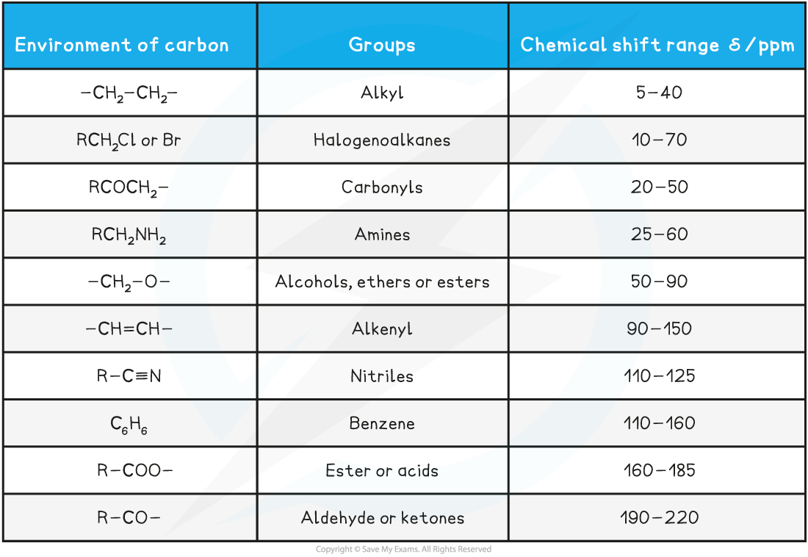
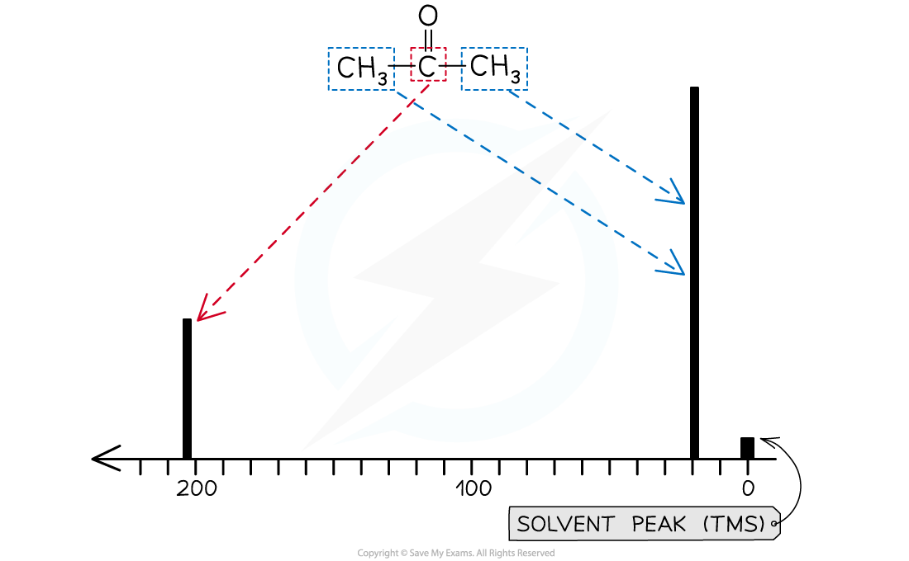
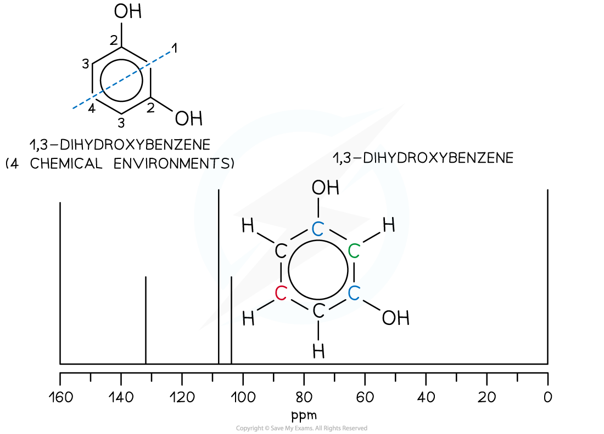

## Using Carbon-13 Data

* Nuclear Magnetic Resonance (NMR) spectroscopy is used for analysing organic compounds
* Atoms with odd mass numbers usually show signals on NMR

  + For example, isotopes of atoms
  + Many of the carbon atoms on organic molecules are carbon-12
  + A small quantity of organic molecules will contain the isotope carbon-13 atoms
  + These will show signals on a 13C NMR
* In 13C NMR, the magnetic field strengths of carbon-13 atoms in organic compounds are measured and recorded on a spectrum
* Just as in 1H NMR, all samples are measured against a reference compound – Tetramethylsilane (TMS)
* On a 13C NMR spectrum, non-equivalent carbon atoms appear as peaks with different chemical shifts

**Chemical Shift Values (relative to the TMS) for** **13****C NMR Analysis Table**

#### Features of a 13C NMR spectrum

* 13C NMR spectrum displays sharp single signals

  + There are no complicated spitting patterns like 1H NMR spectra
* The height of each signal is **not proportional** to the number of carbon atoms present in a single molecular environment
* Carbon atoms in different chemical environments will give resonances at different chemical shifts in a 13C spectrum
* As with 1H NMR, tetramethylsilane is used as the standard reference point for 13C at 0 ppm

#### Identifying 13C molecular environments

* On an organic molecule, the carbon-13 environments can be identified in a similar way to the proton environments in 1H NMR
* For example propanone

  + There are 2 molecular environments
  + 2 signals will be present on its 13C NMR spectrum

***There are 2 molecular environments in propanone***

***The*** ***13******C NMR of propanone showing 2 signals for the 2 molecular environments***

#### Examiner Tips and Tricks

Counting the number of 13C resonances should be the first step in analysing a spectrum. For example, it is possible to differentiate the three isomers of dihydroxybenzene quickly be considering the symmetry of the molecules and therefore the number of resonances expected in their spectra.

#### Worked Example

How many chemical environments and therefore number of peaks / resonances would be in a 13C  spectra of 1,3-dihydroxybenzene?

**Answer:**

4 chemical environments and therefore four peaks / resonances on the spectra

