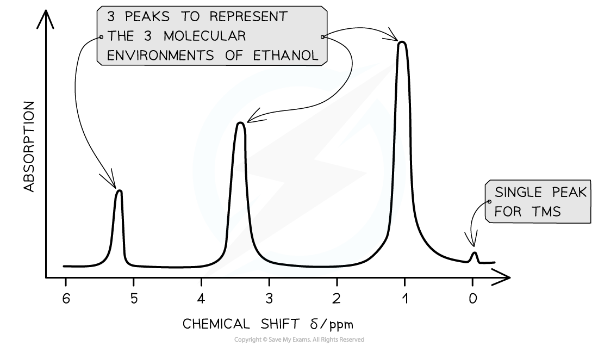
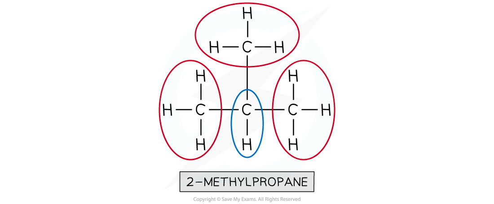
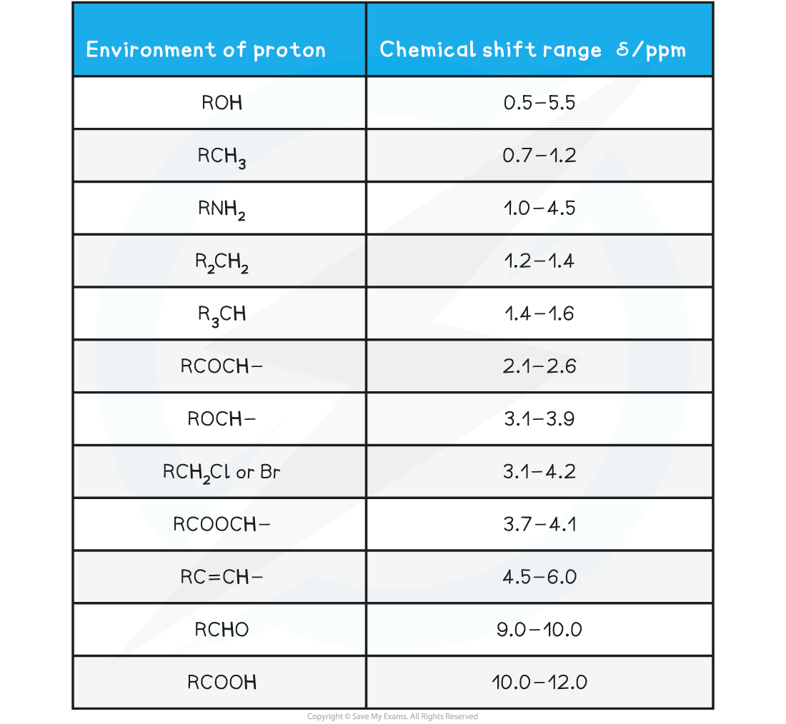
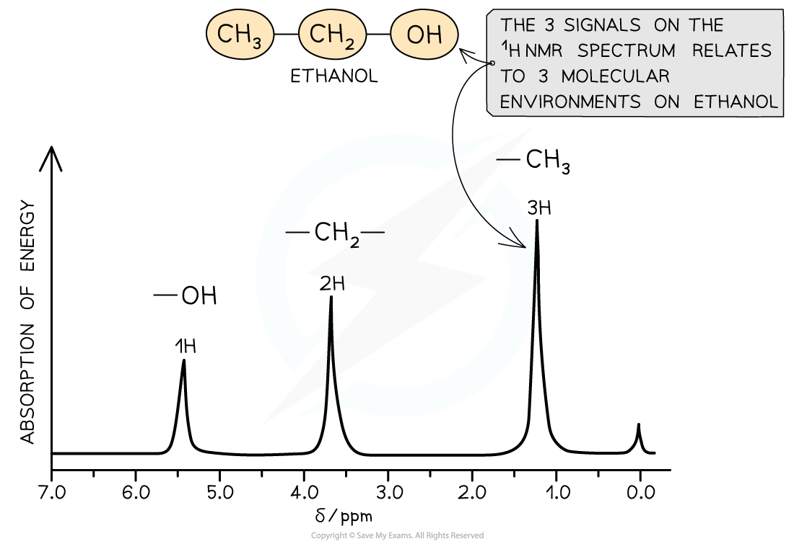
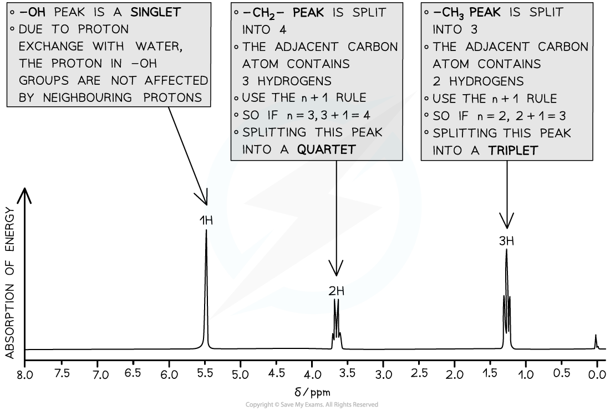
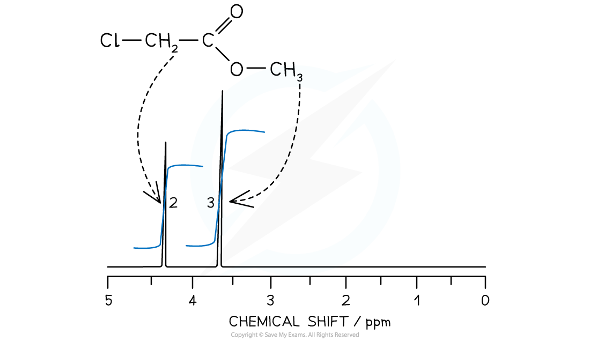
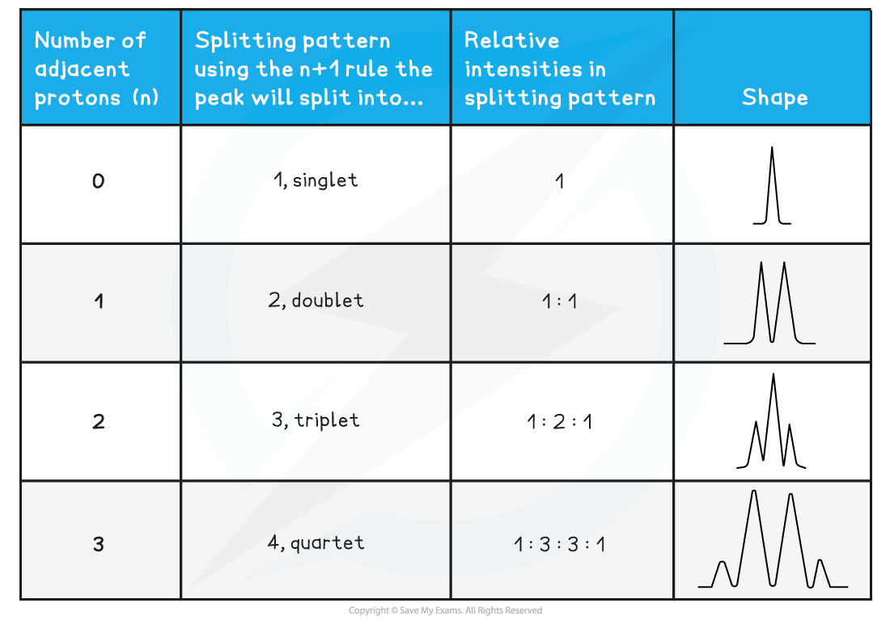
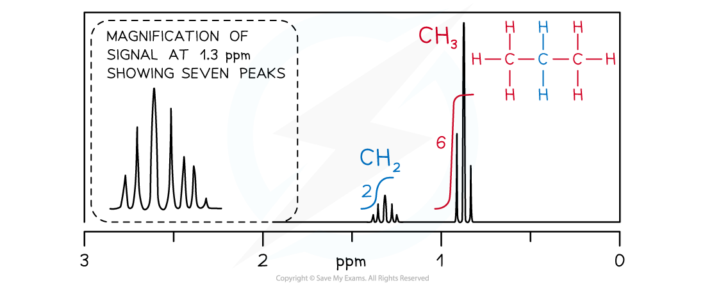

## Proton NMR - Introduction

* **Nuclear Magnetic Resonance (NMR)** spectroscopy is used for analysing organic compounds
* All samples are measured against a reference compound – **Tetramethylsilane (TMS)**

***Tetramethylsilane is the common reference compound for NMR spectroscopy***

* TMS shows a single sharp peak on NMR spectra, at a value of zero
* TMS is also used because it is:

  + Non toxic.
  + Does not react with the sample.
  + Easily separated from the sample molecule due to its low boiling point.
  + Produces one strong, sharp absorption peak on the spectrum.
* Sample peaks are then plotted as a ‘shift’ away from this reference peak
* This gives rise to ‘chemical shift’ values for protons on the sample compound
* Chemical shifts are measured in parts per million (ppm)

#### Features of a 1H NMR spectrum

* NMR spectra shows the intensity of each peak against their chemical shift
* The area under each peak gives information about the number of protons in a particular environment
* The height of each peak shows the intensity / absorption from protons
* A single sharp peak is seen to the far right of the spectrum

  + This is the reference peak from TMS
  + Usually at chemical shift 0 ppm

***A low resolution*** ***1******H NMR for ethanol showing the key features of a spectrum***

#### Molecular environments

* 1H nuclei that have different neighboring atoms (said to have different **chemical environments**) absorb at slightly different field strengths
* The difference environments are said to cause a **chemical shift** of the absorption

  + Ethanol has the structural formula CH3CH2OH
  + There are 3 chemical environments: -CH3, -CH2 and -OH
* The hydrogen atoms in these environments will appear at 3 different chemical shifts
* Different types of protons are given their own range of chemical shifts

#### Worked Example

How many different 1H chemical environments occur in 2-methylpropane?

**Answer:**

Two different 1H chemical environments occur in 2-methylpropane

* The three methyl groups are in the same 1H environment

  + The lone hydrogen is in its own 1H environment

**Chemical Shift Values for** **1****H Molecular Environments Table**

* Protons in the same chemical environment are chemically equivalent

  + 1,2-dichloroethane, Cl-CH2-CH2-Cl has one chemical environment as these four hydrogens are all exactly equivalent
* Each individual peak on a 1H NMR spectrum relates to protons in the same environment

  + Therefore, 1,2-dichloroethane would produce one single peak on the NMR spectrum as the protons are in the same environment

#### Low resolution 1H NMR

* Peaks on a low resolution NMR spectrum refers to molecular environments of an organic compound

  + Ethanol has the molecular formula CH3CH2OH
  + This molecule as 3 separate environments: -CH3, -CH2, -OH
  + So 3 peaks would be seen on its spectrum at 1.2 ppm (-CH3), 3.7 ppm (-CH2) and 5.4 ppm (-OH)
  + The strengths of the absorptions are proportional to the number of equivalent 1H atoms causing the absorption and are measured by the area underneath each absorption peak
  + Hence, the areas of absorptions of -CH3, -CH2, -OH are in the ratio of 3:2:1 respectively

***A low resolution NMR spectrum of ethanol showing 3 peaks for the 3 molecular environments***

## Using High Resolution Proton NMR Data

#### High resolution 1H NMR

* More structural details can be deduced using high resolution NMR
* The peaks observed on a high resolution NMR may sometimes have smaller peaks clustered together
* The splitting pattern of each peak is determined by the number of protons on neighbouring environments

**The number of peaks a signal splits into = n + 1**

(Where n = the number of protons on the adjacent carbon atom)

***High resolution*** ***1******H NMR spectrum of ethanol showing the splitting patterns of each of the 3 peaks. Using the n+1, it is possible to interpret the splitting pattern***

* Each splitting pattern also gives information on relative intensities

  + A doublet has an intensity ratio of 1:1 – each peak is the same intensity as the other
  + In a triplet, the intensity ratio is 1:2:1 – the middle of the peak is twice the intensity of the 2 on either side
  + In a quartet, the intensity ratio is 1:3:3:1 – the middle peaks are three times the intensity of the 2 outer peaks

#### Integrated spectra

* In 1H NMR, the relative areas under each peak give the ratio of the number of protons responsible for each peak
* The NMR spectrometer measures the area under each peak, as an integration spectra

  + This provides invaluable information for identifying an unknown compound
* The 1H NMR of methyl chloroethanoate, C*l*CH2COOCH3,will show an integration spectra in the peak area ratio of 2:3

  + 2 for the protons in the CH2
  + 3 for the protons in CH3

#### Spin-Spin Splitting

* A 1H NMR peak can show you the structure of the molecule but also the peaks can be split into sub-peaks or splitting patterns
* These are caused by a proton's spin interacting with the spin states of nearby protons that are in different environments

  + This can provide information about the number of protons bonded to adjacent carbon atoms
  + The splitting of a main peak into sub-peaks is called spin-spin splitting

#### The n+1 rule

* The number of sub-peaks is one greater than the number of adjacent protons causing the splitting

  + For a proton with *n*protons attached to an adjacent carbon atom, the number of sub-peaks in a splitting pattern = *n*+1
* When analysing spin-spin splitting, it shows you the number of hydrogen atoms on the immediately adjacent carbon atom
* These are the splitting patterns that you need to be able to recognise from a 1H spectra:

**1****H NMR Peak Splitting Patterns Table**

* Splitting patterns must occur in pairs, because each protons splits the signal of the other
* There are some common splitting pairs you will see in a spectrum however you don't need to learn these but can be worked out using the *n*+1 rule

  + You will quickly come to recognise the triplet / quartet combination for a CH3CH2 because it is so common

#### Common pair of splitting patterns

* A quartet and a triplet in the same spectrum usually indicate an ethyl group, CH3CH2-
* The signal from the CH3 protons is split as a triplet by having two neighbours
* The signal from the CH2protons is split as a quartet by having three neighbours
* Here are some more common pairs of splitting patterns

***Common pairs of splitting patterns***

#### 1H NMR spectrum of propane

* The CH2 signal in propane (blue) is observed as a heptet because it has six neighbouring equivalent H atoms (*n*+1 rule), three either side in two equivalent CH3 groups
* The CH3 groups (red) produce identical triplets by coupling with the CH2 group

#### Worked Example

For the compound (CH3)2CHOH predict the following:

i) the number of peaks

ii) the type of proton and chemical shift (using the Data sheet)

iii) the relative peak areas

iv) the split pattern

**Answers:**

i) 3 peaks

ii) (C**H****3**)**2**CHOH at 0.7 - 1.2 ppm, (CH3)2C**H**OH at 3.1 - 3.9 ppm, (CH3)2CHO**H** at 0.5 - 5.5 ppm

iii) Ratio 6 : 1 : 1

iv) (C**H****3**)**2**CHOH split into a doublet (1+1=2), (CH3)2C**H**OH split into a heptet (6+1=7)