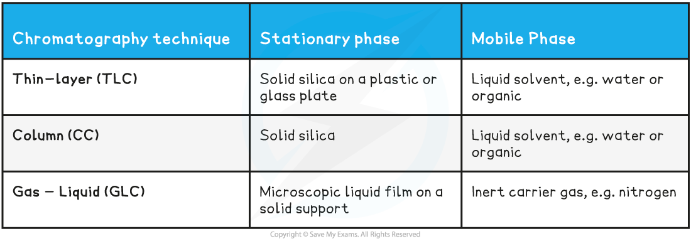
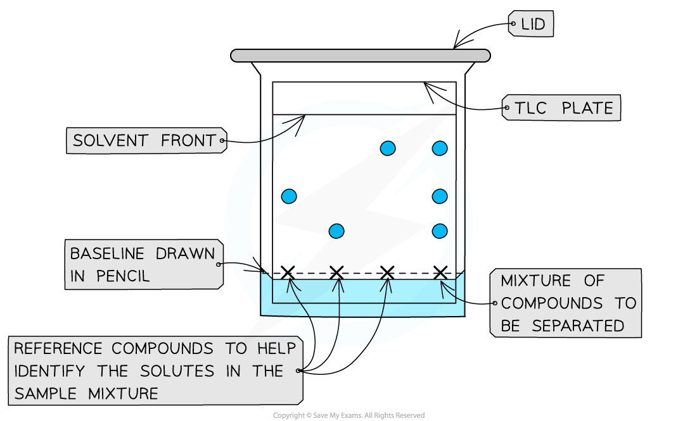
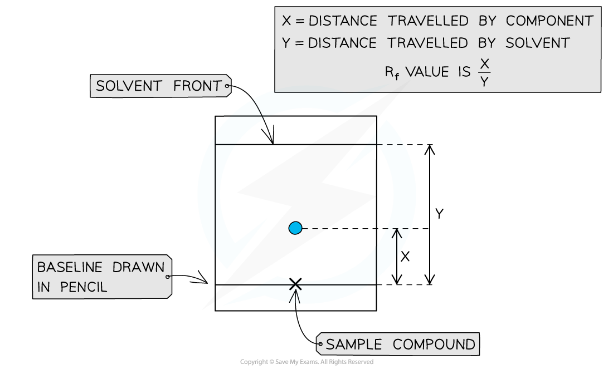

Thin Layer Chromatography
-------------------------

#### Principles of Chromatography

* Chromatography is a technique that enables the separation of mixtures and includes:

  + thin-layer chromatography (TLC)
  + column chromatography (CC)
  + gas chromatography (GC) - sometimes called gas-liquid chromatography (GLC)
* All of these chromatography techniques makes use of the principle that components in a mixture when dissolved in a fluid (<b>mobile phase</b>), will flow through another material (<b>stationary phase</b>) at varying rates
* The rate of separation depends upon how the components in the mixture interact with the stationary phase (their<b> retention</b>) and how soluble they are in the mobile phase

<b>Summary Table of Chromatography Component Phases</b>

#### Thin-layer chromatography

* Thin-layer chromatography (TLC) is a technique used to analyse small samples via separation

  + For example, we could separate a dye out to determine the mixture of dyes in a forensic sample
* There are 2 phases involved in TLC:

  + <b>Stationary phase</b>

    - This phase is commonly thin metal sheet coated in alumina (Al2O3) or silica (SiO2)
    - The solute molecules <b>adsorb</b> onto the surface
    - Depending on the strength of interactions with the stationary phase, the separated components will travel particular distances through the plate
    - The more they interact with the stationary phase, the more they will 'stick' to it
  + <b>Mobile phase</b>

    - Flows over the stationary phase
    - It is a polar or non-polar liquid (solvent) that carries components of the compound being investigated
    - Polar solvents - water or alcohol
    - Non-polar solvents - alkanes
* If the sample components are coloured, their spots are easily identifiable on the chromatogram
* If the sample components are not coloured, then we can <b>locate</b> the spots on the chromatogram and draw around them in pencil

  + To <b>locate</b> the spots we can use:

    - UV light
    - Ninhydrin (carcinogenic)
    - Iodine vapour

#### Conducting a TLC analysis

* <b>Step 1:</b>

  Prepare a beaker with a small quantity of solvent
* <b>Step 2:</b>

  On a TLC plate, draw a horizontal line at the bottom edge (in pencil)

  This is called the <b>baseline</b>
* <b>Step 3:</b>

  Place a spot of pure reference compound on the left of this line, then a spot of the sample to be analysed to the right of the baseline and allow to air dry

  The reference compounds will allow identification of the mixture of compounds in the sample
* <b>Step 4:</b>

  Place the TLC plate inside the beaker with solvent - making sure that the solvent does not cover the spot - and place a lid to cover the beaker

  The solvent will begin to travel up the plate, dissolving the compounds as it does
* <b>Step 5:</b>

  As solvent reaches the top, remove the plate and draw another pencil line where the solvent has reached, indicating the <b>solvent front</b>

  The sample’s components will have separated and travelled up towards this solvent front

*<b>A dot of the sample is placed on the baseline and allowed to separate as the mobile phase flows through the stationary phase; The reference compound/s will also move with the solvent</b>*

#### Retention factor, Rf, values

* A TLC plate can be used to calculate Rf values for compounds

*R*f = ![fraction numerator distance space travelled space by space component over denominator distance space travelled space by space solvent end fraction](data:image/svg+xml;charset=utf8,%3Csvg%20xmlns%3D%22http%3A%2F%2Fwww.w3.org%2F2000%2Fsvg%22%20xmlns%3Awrs%3D%22http%3A%2F%2Fwww.wiris.com%2Fxml%2Fmathml-extension%22%20height%3D%2247%22%20width%3D%22241%22%20wrs%3Abaseline%3D%2230%22%3E%3C!--MathML%3A%20%3Cmath%20xmlns%3D%22http%3A%2F%2Fwww.w3.org%2F1998%2FMath%2FMathML%22%3E%3Cmfrac%3E%3Cmrow%3E%3Cmi%3Edistance%3C%2Fmi%3E%3Cmo%3E%26%23xA0%3B%3C%2Fmo%3E%3Cmi%3Etravelled%3C%2Fmi%3E%3Cmo%3E%26%23xA0%3B%3C%2Fmo%3E%3Cmi%3Eby%3C%2Fmi%3E%3Cmo%3E%26%23xA0%3B%3C%2Fmo%3E%3Cmi%3Ecomponent%3C%2Fmi%3E%3C%2Fmrow%3E%3Cmrow%3E%3Cmi%3Edistance%3C%2Fmi%3E%3Cmo%3E%26%23xA0%3B%3C%2Fmo%3E%3Cmi%3Etravelled%3C%2Fmi%3E%3Cmo%3E%26%23xA0%3B%3C%2Fmo%3E%3Cmi%3Eby%3C%2Fmi%3E%3Cmo%3E%26%23xA0%3B%3C%2Fmo%3E%3Cmi%3Esolvent%3C%2Fmi%3E%3C%2Fmrow%3E%3C%2Fmfrac%3E%3C%2Fmath%3E--%3E%3Cdefs%3E%3Cstyle%20type%3D%22text%2Fcss%22%2F%3E%3C%2Fdefs%3E%3Cline%20stroke%3D%22%23000%22%20stroke-linecap%3D%22square%22%20stroke-width%3D%221%22%20x1%3D%222.5%22%20x2%3D%22237.5%22%20y1%3D%2223.5%22%20y2%3D%2223.5%22%2F%3E%3Ctext%20font-family%3D%22Times%20New%20Roman%22%20font-size%3D%2218%22%20text-anchor%3D%22middle%22%20x%3D%2233.5%22%20y%3D%2216%22%3Edistance%3C%2Ftext%3E%3Ctext%20font-family%3D%22Times%20New%20Roman%22%20font-size%3D%2218%22%20text-anchor%3D%22middle%22%20x%3D%2298.5%22%20y%3D%2216%22%3Etravelled%3C%2Ftext%3E%3Ctext%20font-family%3D%22Times%20New%20Roman%22%20font-size%3D%2218%22%20text-anchor%3D%22middle%22%20x%3D%22143.5%22%20y%3D%2216%22%3Eby%3C%2Ftext%3E%3Ctext%20font-family%3D%22Times%20New%20Roman%22%20font-size%3D%2218%22%20text-anchor%3D%22middle%22%20x%3D%22196.5%22%20y%3D%2216%22%3Ecomponent%3C%2Ftext%3E%3Ctext%20font-family%3D%22Times%20New%20Roman%22%20font-size%3D%2218%22%20text-anchor%3D%22middle%22%20x%3D%2247.5%22%20y%3D%2241%22%3Edistance%3C%2Ftext%3E%3Ctext%20font-family%3D%22Times%20New%20Roman%22%20font-size%3D%2218%22%20text-anchor%3D%22middle%22%20x%3D%22112.5%22%20y%3D%2241%22%3Etravelled%3C%2Ftext%3E%3Ctext%20font-family%3D%22Times%20New%20Roman%22%20font-size%3D%2218%22%20text-anchor%3D%22middle%22%20x%3D%22157.5%22%20y%3D%2241%22%3Eby%3C%2Ftext%3E%3Ctext%20font-family%3D%22Times%20New%20Roman%22%20font-size%3D%2218%22%20text-anchor%3D%22middle%22%20x%3D%22196.5%22%20y%3D%2241%22%3Esolvent%3C%2Ftext%3E%3C%2Fsvg%3E)

* These values can be used alongside other analytical data to deduce composition of mixtures

*<b>R</b>**<b>f</b>**<b> values can be calculated by taking 2 measurements from the TLC plate</b>*

#### Examiner Tips and Tricks

The baseline on a TLC plate must be drawn in pencil

Any other medium would interact with the sample component and solvents used in the analysis process.