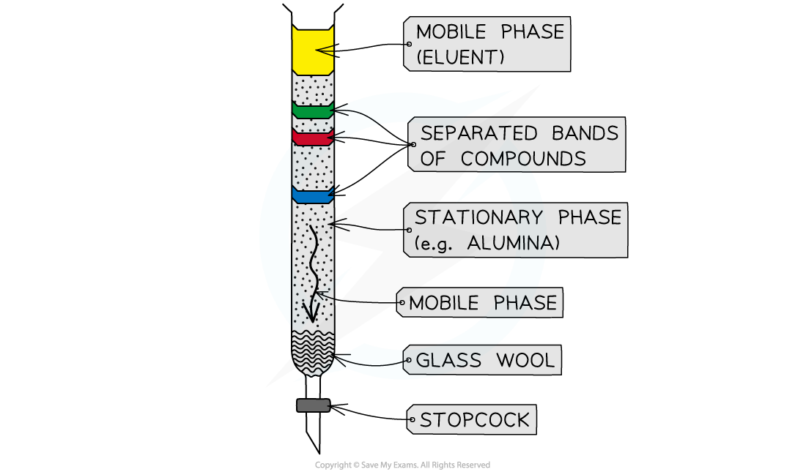
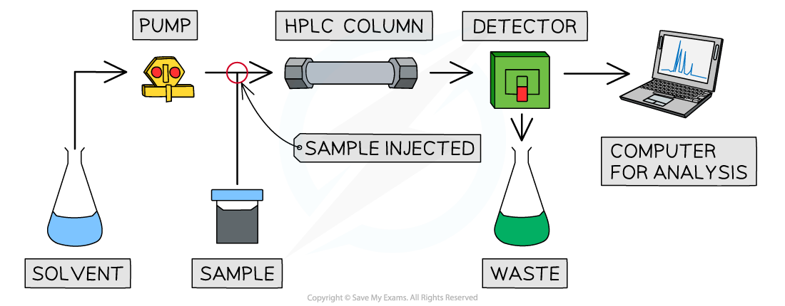
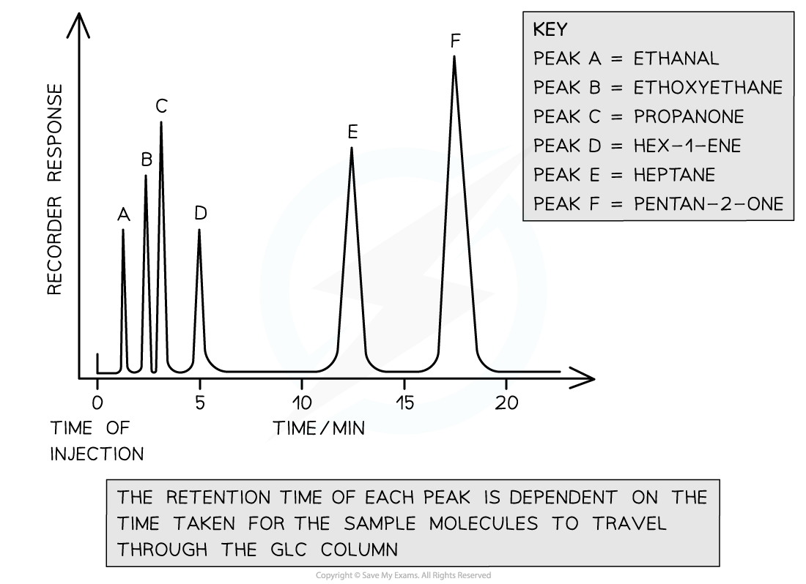
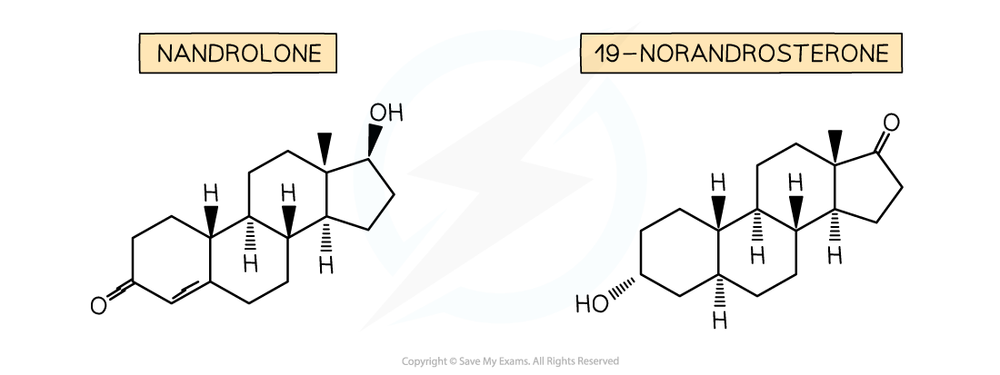

## Types of Column Chromatography

#### Column Chromatography

* In column chromatography, the column is often a long vertical glass tube or in the laboratory a burette is suitable
* An inert solid (usually powdered silica gel or alumina) is the **stationary phase** which is placed in the column
* A liquid solvent phase, **mobile phase**, is added into the column until it is saturated with solvent

  + Care should be taken when setting up the column because cracks in the stationary phase can lead to issues during separation
* The sample mixture is dissolved in the solvent and introduced at the top of the column

  + A pipette is usually used to carefully add the dissolved sample to the top of the column
  + The aim here is to add the sample without disturbing the surface of the column so that the sample runs from one level through the column
* Once the sample has been added, more solvent (**eluent**) is added on top of the sample
* As the solvent runs through, fresh solvent is added to the top of the column so that it does not dry out
* The sample flows through the column via gravity

  + This process can be sped up by pushing the sample and mobile phase through the column
  + In school laboratories, this can be achieved by attaching a gas syringe to the top of the chromatography column
  + In industrial / research laboratories, this is achieved by attaching an air line to the top of the chromatography column
* The component with the greatest attraction / affinity to the stationary phase takes the longest time to flow through the column
* If the components are coloured, then they can be identified using the Rf value
* If the components are colourless, then other techniques such as fluorescence under UV light can be used to show their position in the column

***Column chromatography showing the separation of coloured compounds in a glass burette***

#### High performance liquid chromatography, HPLC

* This is essentially the same as column chromatography
* The main differences are that:

  + The column doesn't work via gravity, the sample is pumped through by the solvent
  + The particles of the stationary phase are much smaller, leading to greater separation of compounds
  + There is a detector at the end of the column which measures **retention time**

    - Retention time is the time taken from the sample being injected to the sample being detected
  + HPLC is automated so the results are obtained quicker
  + The HPLC equipment typically includes a computer which allows for quicker analysis and comparison of results against known compounds in a database

    

#### Gas-Liquid Chromatography, GLC

* Gas-Liquid Chromatography (GLC) is used for analysing:

  + Gases
  + Volatile liquids
  + Solids in their vapour form
* The stationary phase:

  + This method uses a long coiled column for the stationary phase
  + Normally a non-volatile liquid is the stationary phase in GLC
* The Mobile phase

  + An **inert** carrier gas (e.g. helium, nitrogen) moves the sample molecules through the stationary phase
* The sample is injected into the column through a self-sealing disc and the vapour formed is carried through the stationary phase using the inert-gas mobile phase

#### Retention times

* Once sample molecules reach the detector, their **retention times** are recorded

  + This is the time taken for a component to travel through the column
  + It depends upon the attraction between the solute and the stationary and mobile phases as well as the volatility and nature of the solute
* The retention times are recorded on a chromatogram where each peak represents a volatile compound in the analysed sample

  + The relative sizes (i.e. areas) of the peaks are related to how much of each compound is present in the mixture
* Retention times are then compared with data book values to identify unknown molecules

***A gas chromatogram of a volatile sample compound has six peaks. Depending on each molecule’s interaction with the stationary phase, each peak has its own retention time***

#### Worked Example

Analysis of a compound by GLC shows the presence of four components, **A**, **B**, **C** and **D**.

i) Which compound is present in the greatest quantity?

ii) Which compounds were present in equal amounts?

iii) Which compound had the strongest interaction with the stationary phase?

**Answers:**

i) **D** (the larger the relative size of the peak, the greater the quantity of that substance present)

ii) **B** and **C** (the peak sizes are equal)

iii) **D** (the larger the retention time, the greater the interaction of that component with the stationary phase)

#### Uses and limitations of HPLC and GLC

* HPLC and GLC are used to separate small amounts of components from a mixture
* They are often used to:

  + Provide **forensic evidence**
  + **Drug testing**, particularly in sports
  + Analysis of environmental pollution
  + Detecting explosives in baggage
* However, they are not very useful at identifying specific compounds, in legal terms - positive identification or beyond reasonable doubt
* This is because:

  + Different compounds may have the same retention time
  + It can be difficult to manage the conditions, e.g. temperature and pressure
  + Some unknown compounds may not have a reference for comparison in the databases
* For this reason, HPLC and GLC are often coupled with other analytical techniques, most commonly mass spectrometry

  + This results in HPLC-MS and GC-MS (GLC is sometimes abbreviated to GC)
  + This means that components can be separated from mixtures and then analysed all within one machine

#### Problems with drug testing

* GC-MS is the most common method of drug detection in sports due to the accepted reliability of the results
* Even then, there can be problems
* One publicised problem is around the use of anabolic steroids

  + Anabolic steroids can be used by athletes to improve muscle growth, increase production of red blood cells and strengthen bones by increasing their density
  + They are also used to treat conditions such as osteoporosis, anaemia and some cancers
* One high profile anabolic steroid is nandrolone which is metabolised into a similar chemical called 19-norandrosterone

  + Competitors in the Olympic Games are routinely urine tested for the presence of 19-norandrosterone
  + A urine content above 2 nanograms per cm3 (0.000000002 g per cm3) is a positive test and can result in the athlete being disqualified and risking further sanctions
  + There is debate about nandrolone due to its genuine medical applications and the fact that it may be in some nutritional and dietary supplements

    