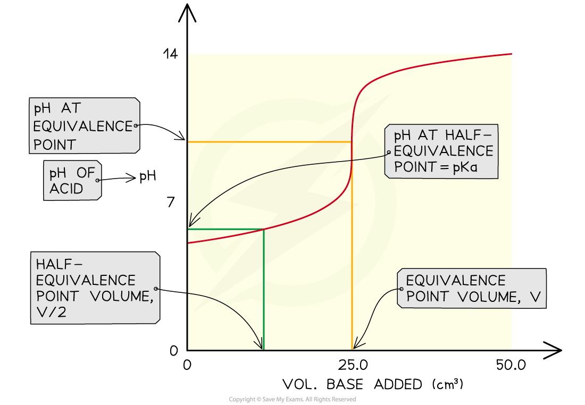

## Core Practical 9: Finding Ka for a Weak Acid

* The *K**a* of a weak acid may be determined by finding the pH at the half equivalence point
* At the half equivalence point *K**a* = [H*+*]

  

**Key steps in the procedure**

* A pH probe or meter is calibrated before use
* 25 cm3 of 0.1 mol dm*-*3 ethanoic acid is pipetted into a conical flask and a few drops of phenolphthalein indicator are added
* A burette is filled with 0.1 mol dm*-*3 sodium hydroxide solution
* The contents of the conical flask are titrated against the sodium hydroxide until the indicator just turns pink
* A further pipette containing 25 cm3 of the acid is then added to the flask and the pH is measured

**Specimen Results**

* pH at half equivalence point = 4.75

**Analysis**

* After the addition of the second portion of acid, the solution is effectively a half-neutralised sample of acid
* This is the half-equivalence point at which the *K**a* = [H*+*]
* By measuring the pH at that point you can convert it to [H*+*] and hence find the *K**a* of the acid

pH = 4.75

[H*+*] = 10-pH = 1.8 x 10-5 mol dm-3

∴  *K**a* = 1.8 x 10-5 mol dm-3

* You can also say that the p*K**a* = pH at the half-equivalence point

***The pH at the half-equivalence point in a weak acid titration gives the pKa of the weak acid***

#### Examiner Tips and Tricks

The sources of uncertainty in this experiment include the measurements made by the pipette and burette, and the judgement of the end-point of the titration.Be careful, there is a single uncertainty in the pipette measurements as one reading was taken but there is double the uncertainty for the burette reading as there was the initial and final readings.