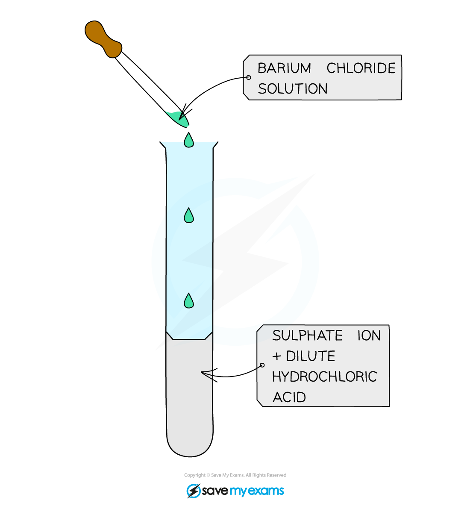

## Core Practical 15: Analysis of Inorganic and Organic Unknowns

#### Testing for positive ions

Simple test tube reactions can be done to identify the following positive ions: Group 2 ions (M2+) Ammonium ions (NH4+)

* If the sample to be tested is a solid, then it must be dissolved in deionised water and made into an aqueous solution

Testing for Group 2 Metal ions Four test tubes should be placed in a test tube rack Around 10 drops of 0.1 mol dm-3 barium chloride solution should be added to the first test tube Around 10 drops of dilute sodium hydroxide solution (NaOH) should be added to the same test tube Swirl the test tube carefully to mix well Continue to add sodium hydroxide dropwise to the test tube, until it is in excess This should then be repeated in the other test tubes, for calcium chloride solution, magnesium chloride solution and strontium chloride solution Any observations should be noted down in a suitable results table The same test as above can also be done using ammonia solution and sulfuric acid solution

**The Positive Results Testing for the Presence of Group 2 Ions**

#### Testing for Ammonium Ions

* About 10 drops of a solution containing ammonium ions, such as ammonium chloride, should be added to a clean test tube
* About 10 drops of sodium hydroxide should be added using a pipette
* The test tube should be swirled carefully to ensure that it is mixed well
* The test tube of the solution should then be placed in a beaker of water, and the beaker of water should be placed above a Bunsen burner, so that it can become a water bath
* As the solution is heated gently, fumes will be produced
* A pair of tongs should be used to hold a damp piece of red litmus paper near the mouth of the test tube, to test the fumes
* The red litmus paper will change colour and become blue in the presence of ammonia gas

***Damp red litmus paper turning blue in the presence of ammonia gas***

#### Testing for negative ions

* Simple test tube reactions can be done to identify the following negative ions:

  + Halide ions (X–)
  + Hydroxide ions (OH–)
  + Carbonate ions (CO32-)
  + Sulfate ions (SO42-)
* If the sample to be tested is a solid, then it must be dissolved in deionised water and made into an aqueous solution

#### Testing for Halide Ions

* The sample being tested should be added using a pipette to a test tube
* The test tube should be placed into a test tube rack
* A small amount of nitric acid should be added to the sample using a pipette, followed by a small amount of silver nitrate solution
* A precipitate will form, either white, cream or yellow, if a halide ion is present in the sample

***The white, cream and yellow precipitates formed when halide ions react with silver nitrate solution***

* The white precipitate will form if chloride ions are present in the sample

  + The white precipitate is AgC*l*
* The cream precipitate will form if bromide ions are present in the sample

  + The cream precipitate is AgBr
* The yellow precipitate will form if iodide ions are present in the sample

  + The yellow precipitate is AgI

#### Further test for halides using ammonia solution

***Results of the test with ammonia to further distinguish between silver halide precipitates***

#### Testing for Hydroxide Ions

* A small amount (around 1 cm3) of the solution should be added to a test tube using a pipette
* Test the pH of the solution using red litmus paper or universal indicator paper

  + The presence of hydroxide ions will turn the red litmus paper blue and the pH will be clearly alkaline on the universal indicator paper if hydroxide ions are present

#### Testing for Carbonate Ions

* A small amount (around 1 cm3) of dilute hydrochloric acid should be added to a test tube using a pipette
* An equal amount of sodium carbonate solution should then be added to the test tube using a clean pipette
* As soon as the sodium carbonate solution is added, a bung with a delivery tube should be attached to the test tube

  + The delivery tube should transfer the gas which is formed into a different test tube which contains a small amount of limewater (calcium hydroxide solution)
* Carbonate ions will react with hydrogen ions from the acid to produce carbon dioxide gas
* Carbon dioxide gas will turn the limewater milky

***When carbon dioxide gas is bubbled into limewater it will turn cloudy as calcium carbonate is produced***

#### Testing for Sulfate Ions

Acidify the sample with dilute hydrochloric acid and then add a few drops of aqueous barium chloride If a sulfate is present then a **white** precipitate of barium sulfate is formed:

**Ba****2+****(aq) + SO****4****2-****(aq) → BaSO****4****(s)**

***A white precipitate of barium sulfate is a positive result for the presence of sulfate ions***

#### Examiner Tips and Tricks

HCl is added first to remove any carbonates which may be present and would also produce a precipitate and interfere with the results.

#### Testing for alkenes / saturation

* Halogens can be used to test if a molecule is **unsaturated** (i.e. contain a double bond)
* Br2 is an orange or yellow solution, called **bromine water**
* The unknown compound is **shaken** with the bromine water
* If the compound is unsaturated, an addition reaction will take place and the coloured solution will decolourise

***The bromine water test is the standard test for unsaturation in alkenes***

#### Testing for alcohols

* Acidified potassium dichromate(VI) (K2Cr2O7) test-tube reaction that can identify **primary** and **secondary alcohols** from **tertiary alcohols**

  + Acidified potassium manganate(VII) (KMnO4) can also be used

**Positive Test Result:**

* Primary and secondary alcohols are oxidised to aldehydes and ketones respectively (which can be further tested)
* Primary and secondary alcohols will change acidified potassium dichromate(VI) solution from orange to green

  + They will also cause a colour change from purple to colourless  with acidified potassium manganate(VII) solution

***The colour changes associated with testing for primary and secondary alcohols***

#### Testing for carbonyls (general)

* The carbonyl groupundergoes a **condensation**reaction with 2,4-dinitrophenylhydrazine

**Positive Test Result:**

* The **product**formed when 2,4-DNPH is added to a solution that contains an aldehyde or ketone is a **deep-orange precipitate** which can be purified by recrystallisation

***The test tube on the left shows a negative 2,4-DNPH test and the tube on the right shows a positive test***

* The **melting** **point** of the formed precipitate can then be measured and compared to literature values to find out which specific aldehyde or ketone had reacted with 2,4-DNPH

#### Testing for Carbonyls (aldehyde / ketone specific)

* Tollens' reagent, also known as ammoniacal silver nitrate, is a more specific test-tube reaction that can distinguish between aldehydes and ketones

**Positive Test Result:**

* When Tollens' reagent is gently warmed with an aldehyde, the silver mirror is formed

  + This is the positive test result
* When Tollens' reagent is gently warmed with a ketone, no silver mirror will be seen, as the ketone cannot be oxidised by Tollens' reagent, so no reaction takes place

  + This is a negative test result

***The Ag******+******ions in Tollens’ reagent are oxidising agents, oxidising the aldehyde to a carboxylic acid and getting reduced themselves to silver atoms***

* Fehling's solution (or Benedict's solution) is another specific test-tube reaction that can distinguish between aldehydes and ketones

**Positive Test Result:**

* When Fehling's solution is gently warmed with an aldehyde, a brick-red precipitate is formed

  + This is the positive test result
* When Fehling's solution is gently warmed with a ketone, no brick-red precipitate will be seen, as the ketone cannot be oxidised by Fehling's solution, so no reaction takes place

  + This is a negative test result

***The copper(II) ions in Fehling’s solution are oxidising agents, oxidising the aldehyde to a carboxylic acid and getting reduced themselves to copper(I) ions in the Cu******2******O precipitate***

#### Testing for carboxylic acids

* Solid sodium carbonate, Na2CO3 (s), or aqueous sodium hydrogen carbonate, NaHCO3 (aq), can be used to test for the presence of a carboxylic acid

**Positive Test Result:**

* Effervescence / bubbles of gas are seen as carbon dioxide is evolved