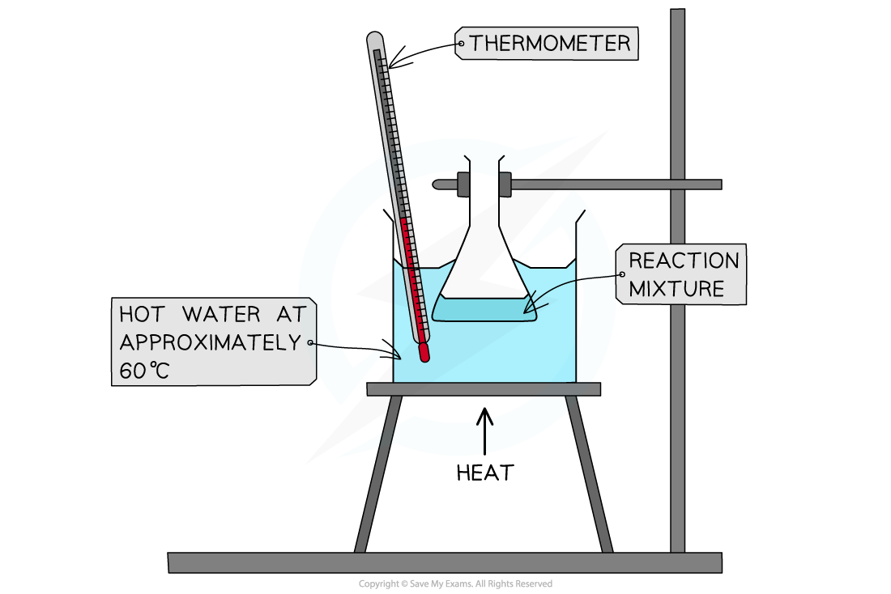
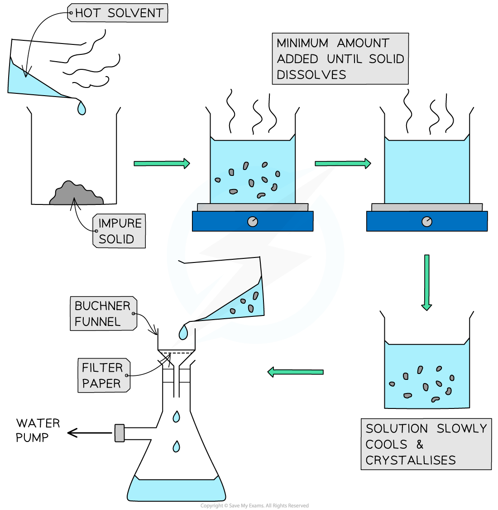
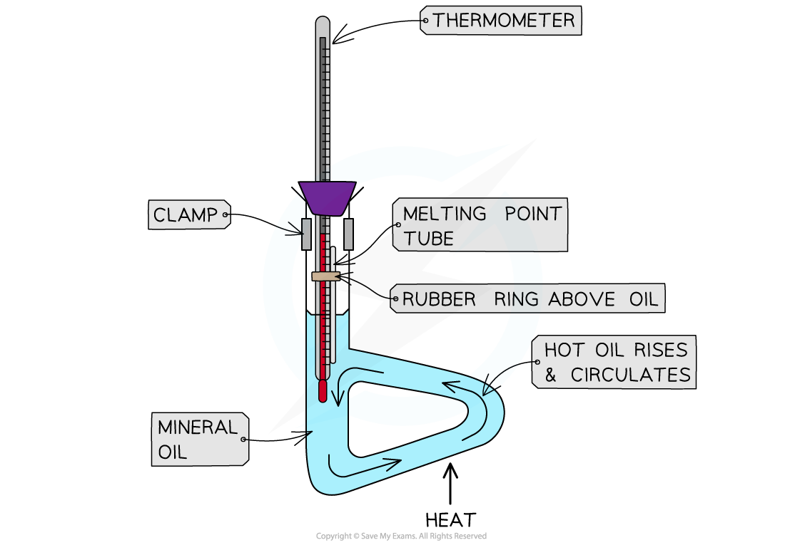

## Core Practical 16: Preparation of Aspirin

* This practical covers a number of key laboratory skills

  + use appropriate apparatus to record a range of measurements
  + use water bath or electric heater or sand bath for heating
  + use laboratory apparatus for a variety of experimental techniques
  + purify a solid product by recrystallisation
  + use melting point apparatus
  + safely and carefully handle solids and liquids

#### Synthesis of Aspirin

**Key steps in the procedure**

* 6.0 g of salicylic acid is added to a conical flask along with 10 cm3 of ethanoic anhydride and 5 drops of concentrated sulfuric acid
* The mixture is swirled and held in a warm water bath around 60 oC for about 20 minutes
* The flask is then allowed to cool and the contents are added to 75 cm3 cold water in a beaker at which point the aspirin crystallises out
* The aspirin is recovered using Buchner filtration and left to dry

***The preparation of aspirin using a hot water bath***

**Recrystallisation and melting point test**

* The impure aspirin is recrystalised using ethanol, and when the solid has dissolved the solution is poured over 40 cm3 cold water and recovered using Buchner filtration as before
* The melting point of pure aspirin is 135 oC, so the purity of the product can be assessed

#### Recrystallisation

* Recrystallisation is used to purify impure solids
* The principle is that a hot solvent is used to dissolve both the organic solid and the impurities and then as the solution cools the solid crystallises out and leaves behind the impurities in the solution
* The key is using the minimum amount of solvent to dissolve the solid and avoid loss of the product
* If any solid impurities remain in the solution, a hot filtration can be carried out
* Once the solution has cooled down to room temperature and crystallised then the product crystals can be recovered by filtration
* This is faster using Buchner apparatus in which filtration occurs under reduced pressure

***Recrystallisation and Buchner filtration***

* After filtration the product is washed with fresh cold solvent and then allowed to dry on filter paper

#### Examiner Tips and Tricks

Recrystallisation can be repeated more than once to ensure a very pure product, but each time the yield of product will decrease. Slow cooling results in bigger well defined crystals which are easier to filter and dry.

#### Melting point analysis

* The melting point of a solid is indicative of its purity and identity
* A melting point can be matched to a known substance as a means of identification or confirmation of a desired product
* The proximity of a melting point to the actual data book value can express purity

  + Impurities tend to lower the melting point of a solid
* The melting point range also reveals the degree of purity

  + Pure substances have sharp well defined melting points
  + Impure substances have a broad melting point range, i.e. a large difference between when the substance first melts until it completely melts
* The skills needed in performing a melting point test are largely dependent on the specific melting point apparatus you are using
* However, there are some common key skills:

  + Correctly preparing the melting point tubes
  + Heating the tubes very slowly
  + Repeating to get a range of measurements (three would be normal)
* The sample solid must be totally dry and finely powdered - this can be achieved by crushing it with the back of a spatula onto some filter paper or the back of a white tile (this absorbs any moisture)
* Use the first tube to find the approximate melting point range and then repeat using a much slower heating rate

***Melting point test using an oil bath***

***Melting point test using a Thiele tube***

***Melting point test using a melt station***

#### Examiner Tips and Tricks

Always quote a melting point as a range + or - and reference a data book value if you have one.